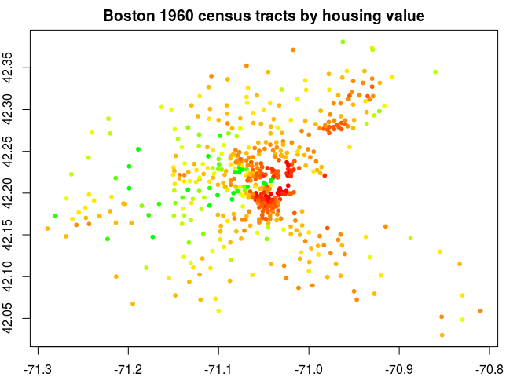
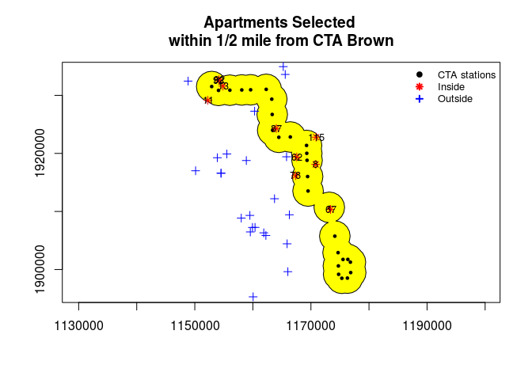

spatialanalaysis.R
================
Chieko Maene
February 3, 2017

####################################################################################### 

Working Space Preparation
-------------------------

##### - Set a working directory where we save our workshop data

##### - Download workshop files

####################################################################################### 

``` r
# STEP 1 # let's start fresh by clearing all R objects uploaded so far
rm(list = ls())

# STEP 2 # set working directory
setwd("/home/cmaene/Documents/R/Rworkshop")

# # STEP 3 # download workshop files for today
# download.file("http://home.uchicago.edu/~cmaene/data.zip", destfile="data.zip")
# download.file("http://home.uchicago.edu/~cmaene/spatialanalysis.html", destfile="spatialanalysis.html")
# download.file("http://home.uchicago.edu/~cmaene/SpatialAnalysisUsingR.pdf", destfile="SpatialAnalysisUsingR.pdf")

# STEP 4 # unzip the workshop data and move to the data directory
unzip("data.zip")
setwd("data")
```

####################################################################################### 

About R Packages
----------------

#### Required packages: sp, rgdal, rgeos, spdep, RColorBrewer, classInt, maptools, SDMTools, raster, gstat

##### install/upload all libraries to be used in the workshop and explore some

####################################################################################### 

``` r
# # STEP 1 # currently, what R packages are uploaded?
# (.packages())
# 
# # STEP 2 # install a package from a specified respository
# # I like to install one package at a time - installation messages are informative and useful in case anything goes wrong:
# # install.packages("sp", repos='http://cran.us.r-project.org')          # pretty much all spatial packages depend on this
# # install.packages("rgdal", repos='http://cran.us.r-project.org')       # for data reading/writing - the best, most versatile tool
# # install.packages("rgeos", repos='http://cran.us.r-project.org')       # for spatial data anlaysis - for querying spatial objects
# install.packages("spdep", repos='http://cran.us.r-project.org')         # spatial econometrics tools for exploring & dealing with spatial-dependency
# install.packages("RColorBrewer", repos='http://cran.us.r-project.org')  # the color palette for creating colorful graph/charts/maps
# install.packages("classInt", repos='http://cran.us.r-project.org')      # for classifying values - often paired with RColorBrewer
# install.packages("maptools", repos='http://cran.us.r-project.org')      # maptools - for creating popular map types
# install.packages("raster", repos='http://cran.us.r-project.org')        # for "raster" data
# install.packages("gstat", repos='http://cran.us.r-project.org')         # point-base spatial statistics tool
# install.packages("SDMTools", repos='http://cran.us.r-project.org')      # useful toolset - used for vincenty/geodesic distance calculation

# STEP 3 # upload the libraries we need to the current workspace:
#library(sp)    # normally, I skip "sp" when using "rgdal"
library(rgdal)
library(rgeos)
library(spdep)
library(RColorBrewer)
library(classInt)
library(maptools)
library(raster)
library(gstat)
library(SDMTools)

# or more sophisticated way, i.e. install packages only if not previously installed
# http://stackoverflow.com/questions/15155814/check-if-r-package-is-installed-then-load-library

# STEP 4 # what R packages are uploaded now?
(.packages())
```

    ##  [1] "SDMTools"     "gstat"        "raster"       "maptools"    
    ##  [5] "classInt"     "RColorBrewer" "spdep"        "Matrix"      
    ##  [9] "rgeos"        "rgdal"        "sp"           "stats"       
    ## [13] "graphics"     "grDevices"    "utils"        "datasets"    
    ## [17] "methods"      "base"

``` r
# STEP 5 # what other packages are available for up-loading, i.e. library(-name-of-the-package-here-)
## (remember we can always add more packages by installing them..)
(.packages(all.available=TRUE))
```

    ##   [1] "acepack"      "assertthat"   "base64enc"    "BH"          
    ##   [5] "bitops"       "car"          "caret"        "caTools"     
    ##   [9] "chron"        "classInt"     "coda"         "colorspace"  
    ##  [13] "curl"         "data.table"   "DBI"          "deldir"      
    ##  [17] "devtools"     "dichromat"    "digest"       "dplyr"       
    ##  [21] "e1071"        "evaluate"     "FNN"          "foreach"     
    ##  [25] "foreign"      "formatR"      "Formula"      "gdata"       
    ##  [29] "ggplot2"      "ggvis"        "GISTools"     "git2r"       
    ##  [33] "gmodels"      "gridExtra"    "gstat"        "gtable"      
    ##  [37] "gtools"       "highr"        "Hmisc"        "htmltools"   
    ##  [41] "httpuv"       "httr"         "intervals"    "iterators"   
    ##  [45] "jsonlite"     "knitr"        "labeling"     "latticeExtra"
    ##  [49] "lazyeval"     "LearnBayes"   "likert"       "lme4"        
    ##  [53] "magrittr"     "maps"         "maptools"     "markdown"    
    ##  [57] "MatrixModels" "memoise"      "mime"         "minqa"       
    ##  [61] "mnormt"       "munsell"      "nloptr"       "openssl"     
    ##  [65] "openxlsx"     "pander"       "pbkrtest"     "plyr"        
    ##  [69] "psych"        "quantreg"     "R6"           "randomForest"
    ##  [73] "raster"       "RColorBrewer" "Rcpp"         "RcppEigen"   
    ##  [77] "RCurl"        "reshape2"     "rgdal"        "rgeos"       
    ##  [81] "rJava"        "rmarkdown"    "R.methodsS3"  "R.oo"        
    ##  [85] "rstudioapi"   "R.utils"      "scales"       "SDMTools"    
    ##  [89] "shiny"        "sourcetools"  "sp"           "spacetime"   
    ##  [93] "SparseM"      "spdep"        "stringi"      "stringr"     
    ##  [97] "tibble"       "tidyr"        "tree"         "whisker"     
    ## [101] "withr"        "xlsx"         "xlsxjars"     "xtable"      
    ## [105] "xts"          "yaml"         "zoo"          "base"        
    ## [109] "boot"         "class"        "cluster"      "codetools"   
    ## [113] "compiler"     "datasets"     "graphics"     "grDevices"   
    ## [117] "grid"         "KernSmooth"   "lattice"      "MASS"        
    ## [121] "Matrix"       "methods"      "mgcv"         "nlme"        
    ## [125] "nnet"         "parallel"     "rpart"        "spatial"     
    ## [129] "splines"      "stats"        "stats4"       "survival"    
    ## [133] "tcltk"        "tools"        "utils"

``` r
# STEP 6 # get more information on packages on the machine/server - skip, shows too much
# installed.packages()

# # STEP 7 # get more information on packages on your machine, then save it as data
# # installed.packages() returns a matrix of package names, library paths and version numbers
# pck <-installed.packages()
# colnames(pck) # list of information obtained from installed packages
# View(pck)
# 
# # STEP 8 # test to see if "rgdal" is installed - i.e. find if rgdal is in the first column, "package" name
# "rgdal" %in% pck[,1]
# 
# # STEP 9 # found it? now, get the information about your "rgdal" package
# index <- which(pck[,1]=="rgdal")
# pck[index,]

# STEP 10 # by the way, what is "sp" package?
packageDescription("rgdal")
```

    ## Package: rgdal
    ## Title: Bindings for the Geospatial Data Abstraction Library
    ## Version: 1.1-10
    ## Date: 2016-05-11
    ## Depends: R (>= 2.14.0), methods, sp (>= 1.1-0)
    ## Imports: grDevices, graphics, stats, utils
    ## LinkingTo: sp
    ## Description: Provides bindings to Frank Warmerdam's Geospatial
    ##        Data Abstraction Library (GDAL) (>= 1.6.3) and access to
    ##        projection/transformation operations from the PROJ.4
    ##        library. The GDAL and PROJ.4 libraries are external to the
    ##        package, and, when installing the package from source, must
    ##        be correctly installed first. Both GDAL raster and OGR
    ##        vector map data can be imported into R, and GDAL raster
    ##        data and OGR vector data exported. Use is made of classes
    ##        defined in the sp package. Windows and Mac Intel OS X
    ##        binaries (including GDAL, PROJ.4 and Expat) are provided on
    ##        CRAN.
    ## Authors@R: c( person("Roger", "Bivand", role = c("cre", "aut"),
    ##        email = "Roger.Bivand@nhh.no"), person("Tim", "Keitt", role
    ##        = "aut"), person("Barry", "Rowlingson", role = "aut"),
    ##        person("Edzer", "Pebesma", role = "ctb"), person("Michael",
    ##        "Sumner", role = "ctb"), person("Robert", "Hijmans", role =
    ##        "ctb"), person("Even", "Rouault", role = "ctb"))
    ## License: GPL (>= 2)
    ## URL: http://www.gdal.org,
    ##        https://r-forge.r-project.org/projects/rgdal/
    ## SystemRequirements: for building from source: GDAL >= 1.6.3,
    ##        library from http://trac.osgeo.org/gdal/wiki/DownloadSource
    ##        and PROJ.4 (proj >= 4.4.9) from
    ##        http://download.osgeo.org/proj/; GDAL OSX frameworks built
    ##        by William Kyngesburye at http://www.kyngchaos.com/ may be
    ##        used for source installs on OSX.
    ## NeedsCompilation: yes
    ## Packaged: 2016-05-11 17:51:18 UTC; rsb
    ## Author: Roger Bivand [cre, aut], Tim Keitt [aut], Barry Rowlingson
    ##        [aut], Edzer Pebesma [ctb], Michael Sumner [ctb], Robert
    ##        Hijmans [ctb], Even Rouault [ctb]
    ## Maintainer: Roger Bivand <Roger.Bivand@nhh.no>
    ## Repository: CRAN
    ## Date/Publication: 2016-05-12 14:48:06
    ## Built: R 3.3.1; x86_64-pc-linux-gnu; 2016-07-25 18:47:20 UTC; unix
    ## 
    ## -- File: /usr/local/lib/R/site-library/rgdal/Meta/package.rds

``` r
# STEP 11 # or, get the library information in a View panel
library(help="rgdal")
```

####################################################################################### 

R basics 1
----------

#### Required packages: N/A (use base packages)

##### Create R objects.

####################################################################################### 

``` r
# create a numberic vector - must have the same data type in each vector
a <- 1:6
class(a)
```

    ## [1] "integer"

``` r
# create a character vector
fruits <- c("orange", "apple")
class(fruits)
```

    ## [1] "character"

``` r
# turn (a) vector into a 2 by 3 matrix
dim(a) <- c(2,3)
class(a)
```

    ## [1] "matrix"

``` r
# turn (a) matrix into a data frame
a <- data.frame(a)
class(a)
```

    ## [1] "data.frame"

``` r
# add a column/variable name to (a) data.frame
colnames(a) <- c("var1","var2","var3")
a
```

    ##   var1 var2 var3
    ## 1    1    3    5
    ## 2    2    4    6

``` r
# though, not necessary, add a row/observation name
rownames(a) <- c(1,2)
a
```

    ##   var1 var2 var3
    ## 1    1    3    5
    ## 2    2    4    6

``` r
# add a new column/variable (var4) and fill it with values
a$var4 <- c(98,99)
a
```

    ##   var1 var2 var3 var4
    ## 1    1    3    5   98
    ## 2    2    4    6   99

``` r
# add another vector (fruits) to (a) data.frame using cbind=column-binding
a <- cbind(a,fruits)
a
```

    ##   var1 var2 var3 var4 fruits
    ## 1    1    3    5   98 orange
    ## 2    2    4    6   99  apple

``` r
# add/append a new row/observation to (a) data.frame using rbind=row-binding
a <- rbind(a,c(10:12))
a
```

    ##   var1 var2 var3 var4 fruits
    ## 1    1    3    5   98 orange
    ## 2    2    4    6   99  apple
    ## 3   10   11   12   10   <NA>

``` r
# add a value to the specific cell - row 3 & column 5
a[3,5] <- "orange"
a
```

    ##   var1 var2 var3 var4 fruits
    ## 1    1    3    5   98 orange
    ## 2    2    4    6   99  apple
    ## 3   10   11   12   10 orange

``` r
# subsetting 1 - I want an "apple" observation only
subset1 <- a[a$fruits=="apple",]
subset1
```

    ##   var1 var2 var3 var4 fruits
    ## 2    2    4    6   99  apple

``` r
# subsetting 2 - I want the first and last variables/columns only
subset2 <- a[,c(1,5)]
subset2
```

    ##   var1 fruits
    ## 1    1 orange
    ## 2    2  apple
    ## 3   10 orange

``` r
# here is another way - works if data.frame comes with "colnames" attribute
subset2 <- a[,c("var1","fruits")]
subset2
```

    ##   var1 fruits
    ## 1    1 orange
    ## 2    2  apple
    ## 3   10 orange

####################################################################################### 

R basics 2
----------

#### Required packages: spdep

##### Instead of creating data of our own, let's use popular tutorial dataset

####################################################################################### 

``` r
# STEP 1 # install and upload "spdep" library
# install.packages("spdep")
# library("spdep")

# STEP 2 # like most packages, "spdep" package comes with tutorial data, try Boston housing price data
# you will see two data frames (boston.c & boston.utm) and a list object, "boston.soi".
data(boston)

# STEP 3 # what's "boston"?
# use help function to get the dataset description
?boston          # or "help(boston)"

# STEP 4 # there are many ways to look at a data frame object
class(boston.c)   # tells the class of the object
```

    ## [1] "data.frame"

``` r
str(boston.c)     # displays the structure of the object
```

    ## 'data.frame':    506 obs. of  20 variables:
    ##  $ TOWN   : Factor w/ 92 levels "Arlington","Ashland",..: 54 77 77 46 46 46 69 69 69 69 ...
    ##  $ TOWNNO : int  0 1 1 2 2 2 3 3 3 3 ...
    ##  $ TRACT  : int  2011 2021 2022 2031 2032 2033 2041 2042 2043 2044 ...
    ##  $ LON    : num  -71 -71 -70.9 -70.9 -70.9 ...
    ##  $ LAT    : num  42.3 42.3 42.3 42.3 42.3 ...
    ##  $ MEDV   : num  24 21.6 34.7 33.4 36.2 28.7 22.9 27.1 16.5 18.9 ...
    ##  $ CMEDV  : num  24 21.6 34.7 33.4 36.2 28.7 22.9 22.1 16.5 18.9 ...
    ##  $ CRIM   : num  0.00632 0.02731 0.02729 0.03237 0.06905 ...
    ##  $ ZN     : num  18 0 0 0 0 0 12.5 12.5 12.5 12.5 ...
    ##  $ INDUS  : num  2.31 7.07 7.07 2.18 2.18 2.18 7.87 7.87 7.87 7.87 ...
    ##  $ CHAS   : Factor w/ 2 levels "0","1": 1 1 1 1 1 1 1 1 1 1 ...
    ##  $ NOX    : num  0.538 0.469 0.469 0.458 0.458 0.458 0.524 0.524 0.524 0.524 ...
    ##  $ RM     : num  6.58 6.42 7.18 7 7.15 ...
    ##  $ AGE    : num  65.2 78.9 61.1 45.8 54.2 58.7 66.6 96.1 100 85.9 ...
    ##  $ DIS    : num  4.09 4.97 4.97 6.06 6.06 ...
    ##  $ RAD    : int  1 2 2 3 3 3 5 5 5 5 ...
    ##  $ TAX    : int  296 242 242 222 222 222 311 311 311 311 ...
    ##  $ PTRATIO: num  15.3 17.8 17.8 18.7 18.7 18.7 15.2 15.2 15.2 15.2 ...
    ##  $ B      : num  397 397 393 395 397 ...
    ##  $ LSTAT  : num  4.98 9.14 4.03 2.94 5.33 ...

``` r
summary(boston.c) # displays the object summary
```

    ##                 TOWN         TOWNNO          TRACT           LON        
    ##  Cambridge        : 30   Min.   : 0.00   Min.   :   1   Min.   :-71.29  
    ##  Boston Savin Hill: 23   1st Qu.:26.25   1st Qu.:1303   1st Qu.:-71.09  
    ##  Lynn             : 22   Median :42.00   Median :3394   Median :-71.05  
    ##  Boston Roxbury   : 19   Mean   :47.53   Mean   :2700   Mean   :-71.06  
    ##  Newton           : 18   3rd Qu.:78.00   3rd Qu.:3740   3rd Qu.:-71.02  
    ##  Somerville       : 15   Max.   :91.00   Max.   :5082   Max.   :-70.81  
    ##  (Other)          :379                                                  
    ##       LAT             MEDV           CMEDV            CRIM         
    ##  Min.   :42.03   Min.   : 5.00   Min.   : 5.00   Min.   : 0.00632  
    ##  1st Qu.:42.18   1st Qu.:17.02   1st Qu.:17.02   1st Qu.: 0.08204  
    ##  Median :42.22   Median :21.20   Median :21.20   Median : 0.25651  
    ##  Mean   :42.22   Mean   :22.53   Mean   :22.53   Mean   : 3.61352  
    ##  3rd Qu.:42.25   3rd Qu.:25.00   3rd Qu.:25.00   3rd Qu.: 3.67708  
    ##  Max.   :42.38   Max.   :50.00   Max.   :50.00   Max.   :88.97620  
    ##                                                                    
    ##        ZN             INDUS       CHAS         NOX               RM       
    ##  Min.   :  0.00   Min.   : 0.46   0:471   Min.   :0.3850   Min.   :3.561  
    ##  1st Qu.:  0.00   1st Qu.: 5.19   1: 35   1st Qu.:0.4490   1st Qu.:5.886  
    ##  Median :  0.00   Median : 9.69           Median :0.5380   Median :6.208  
    ##  Mean   : 11.36   Mean   :11.14           Mean   :0.5547   Mean   :6.285  
    ##  3rd Qu.: 12.50   3rd Qu.:18.10           3rd Qu.:0.6240   3rd Qu.:6.623  
    ##  Max.   :100.00   Max.   :27.74           Max.   :0.8710   Max.   :8.780  
    ##                                                                           
    ##       AGE              DIS              RAD              TAX       
    ##  Min.   :  2.90   Min.   : 1.130   Min.   : 1.000   Min.   :187.0  
    ##  1st Qu.: 45.02   1st Qu.: 2.100   1st Qu.: 4.000   1st Qu.:279.0  
    ##  Median : 77.50   Median : 3.207   Median : 5.000   Median :330.0  
    ##  Mean   : 68.57   Mean   : 3.795   Mean   : 9.549   Mean   :408.2  
    ##  3rd Qu.: 94.08   3rd Qu.: 5.188   3rd Qu.:24.000   3rd Qu.:666.0  
    ##  Max.   :100.00   Max.   :12.127   Max.   :24.000   Max.   :711.0  
    ##                                                                    
    ##     PTRATIO            B              LSTAT      
    ##  Min.   :12.60   Min.   :  0.32   Min.   : 1.73  
    ##  1st Qu.:17.40   1st Qu.:375.38   1st Qu.: 6.95  
    ##  Median :19.05   Median :391.44   Median :11.36  
    ##  Mean   :18.46   Mean   :356.67   Mean   :12.65  
    ##  3rd Qu.:20.20   3rd Qu.:396.23   3rd Qu.:16.95  
    ##  Max.   :22.00   Max.   :396.90   Max.   :37.97  
    ## 

``` r
head(boston.c)    # prints the first six rows/observations
```

    ##         TOWN TOWNNO TRACT      LON     LAT MEDV CMEDV    CRIM ZN INDUS
    ## 1     Nahant      0  2011 -70.9550 42.2550 24.0  24.0 0.00632 18  2.31
    ## 2 Swampscott      1  2021 -70.9500 42.2875 21.6  21.6 0.02731  0  7.07
    ## 3 Swampscott      1  2022 -70.9360 42.2830 34.7  34.7 0.02729  0  7.07
    ## 4 Marblehead      2  2031 -70.9280 42.2930 33.4  33.4 0.03237  0  2.18
    ## 5 Marblehead      2  2032 -70.9220 42.2980 36.2  36.2 0.06905  0  2.18
    ## 6 Marblehead      2  2033 -70.9165 42.3040 28.7  28.7 0.02985  0  2.18
    ##   CHAS   NOX    RM  AGE    DIS RAD TAX PTRATIO      B LSTAT
    ## 1    0 0.538 6.575 65.2 4.0900   1 296    15.3 396.90  4.98
    ## 2    0 0.469 6.421 78.9 4.9671   2 242    17.8 396.90  9.14
    ## 3    0 0.469 7.185 61.1 4.9671   2 242    17.8 392.83  4.03
    ## 4    0 0.458 6.998 45.8 6.0622   3 222    18.7 394.63  2.94
    ## 5    0 0.458 7.147 54.2 6.0622   3 222    18.7 396.90  5.33
    ## 6    0 0.458 6.430 58.7 6.0622   3 222    18.7 394.12  5.21

``` r
tail(boston.c)    # prints the last  six rows/observations
```

    ##         TOWN TOWNNO TRACT      LON     LAT MEDV CMEDV    CRIM ZN INDUS
    ## 501   Revere     90  1708 -70.9920 42.2380 16.8  16.8 0.22438  0  9.69
    ## 502 Winthrop     91  1801 -70.9860 42.2312 22.4  22.4 0.06263  0 11.93
    ## 503 Winthrop     91  1802 -70.9910 42.2275 20.6  20.6 0.04527  0 11.93
    ## 504 Winthrop     91  1803 -70.9948 42.2260 23.9  23.9 0.06076  0 11.93
    ## 505 Winthrop     91  1804 -70.9875 42.2240 22.0  22.0 0.10959  0 11.93
    ## 506 Winthrop     91  1805 -70.9825 42.2210 11.9  19.0 0.04741  0 11.93
    ##     CHAS   NOX    RM  AGE    DIS RAD TAX PTRATIO      B LSTAT
    ## 501    0 0.585 6.027 79.7 2.4982   6 391    19.2 396.90 14.33
    ## 502    0 0.573 6.593 69.1 2.4786   1 273    21.0 391.99  9.67
    ## 503    0 0.573 6.120 76.7 2.2875   1 273    21.0 396.90  9.08
    ## 504    0 0.573 6.976 91.0 2.1675   1 273    21.0 396.90  5.64
    ## 505    0 0.573 6.794 89.3 2.3889   1 273    21.0 393.45  6.48
    ## 506    0 0.573 6.030 80.8 2.5050   1 273    21.0 396.90  7.88

``` r
View(boston.c)    # opens data frame view window..

# STEP 5 # a-ha! this data has a special component - Longitude/X and Latitude/Y !
# Note: each observation represents a 1960 census tract (adminitrative unit)
par(mar = c(2, 2, 2, 2))
plot(boston.c$LON, boston.c$LAT, main="Boston 1960 census tract centroids", axes=TRUE)
```


``` r
# STEP 6 # we can change the point symbol type (pch), color (col), size (cex) as we like
# see the "points" help document
?points

# STEP 7 # Not pretty.. let's assign colors which represent median housing values
# R is known for its sophisticated & flexible graphic capability
cPalet <- colorRampPalette(c("red", "yellow", "green"))
cValue <- cPalet(12)[as.numeric(cut(boston.c$MEDV, breaks=12))]
plot(boston.c$LON, boston.c$LAT, col=cValue, pch=20, main="Boston 1960 census tracts by housing value")
```



####################################################################################### 

Spatial Data
------------

#### Required packages: sp, rgeos

##### We will create and save three spatial data in sp's spatial data frame format.

##### Three components of typical spatial data files are:

##### 1. geometry (collection of vertices/coordinates/XY)

##### 2. attributes (data frame)

##### 3. Coordinate Reference System (CRS)

####################################################################################### 

``` r
# STEP 1 # install & upload libraries
# install.packages("rgeos", repos="http://cran.us.r-project.org")
# library(rgeos)
# start fresh by clearing all R objects uploaded so far
setwd("/home/cmaene/Documents/R/Rworkshop/data")
rm(list = ls())

##### points - spatial points data frame

# STEP 2 # create three new vectors each with four objects
# each vector represents a variable (and contains observation values)
# c() concatenates list of values
point_x=c(-87.602659, -87.601534, -87.602798, -87.599917)                    
point_y=c(41.791582, 41.789765, 41.790530, 41.792185)                        
point_name=c("BSLC lab","Bookstore", "Crerar Library","Regenstein Library")

# STEP 3 # combine the vectors to create a table, aka. "data frame"
# "data frame" is a list of vectors of equal lepoint_table=data.frame(point_name, point_x, point_y)
point_table=data.frame(point_name, point_x, point_y)

# STEP 4 # view data frame
class(point_table)      # tells the class of the object
```

    ## [1] "data.frame"

``` r
str(point_table)        # displays the structure of the object
```

    ## 'data.frame':    4 obs. of  3 variables:
    ##  $ point_name: Factor w/ 4 levels "Bookstore","BSLC lab",..: 2 1 3 4
    ##  $ point_x   : num  -87.6 -87.6 -87.6 -87.6
    ##  $ point_y   : num  41.8 41.8 41.8 41.8

``` r
summary(point_table)    # displays the object summary
```

    ##               point_name    point_x         point_y     
    ##  Bookstore         :1    Min.   :-87.6   Min.   :41.79  
    ##  BSLC lab          :1    1st Qu.:-87.6   1st Qu.:41.79  
    ##  Crerar Library    :1    Median :-87.6   Median :41.79  
    ##  Regenstein Library:1    Mean   :-87.6   Mean   :41.79  
    ##                          3rd Qu.:-87.6   3rd Qu.:41.79  
    ##                          Max.   :-87.6   Max.   :41.79

``` r
head(point_table)       # prints the first six rows/observations
```

    ##           point_name   point_x  point_y
    ## 1           BSLC lab -87.60266 41.79158
    ## 2          Bookstore -87.60153 41.78977
    ## 3     Crerar Library -87.60280 41.79053
    ## 4 Regenstein Library -87.59992 41.79219

``` r
colnames(point_table)   # list of column/variable names
```

    ## [1] "point_name" "point_x"    "point_y"

``` r
# STEP 5 # turn the table/data frame into "SpatialPoints"
# "SpatialPoints" requires XY coordinates - values from two columns in "point_table"
points <- SpatialPoints(point_table[,c("point_x","point_y")])

# STEP 6 # turn the table/data frame into "SpatialPointsDataFrame"
# the difference is an accompanying data frame/attributes
points <- SpatialPointsDataFrame(point_table[,c("point_x","point_y")], point_table)

# STEP 7 # check data.. some ways to look at the objects
str(points)       # str (structure) often show too much information
```

    ## Formal class 'SpatialPointsDataFrame' [package "sp"] with 5 slots
    ##   ..@ data       :'data.frame':  4 obs. of  3 variables:
    ##   .. ..$ point_name: Factor w/ 4 levels "Bookstore","BSLC lab",..: 2 1 3 4
    ##   .. ..$ point_x   : num [1:4] -87.6 -87.6 -87.6 -87.6
    ##   .. ..$ point_y   : num [1:4] 41.8 41.8 41.8 41.8
    ##   ..@ coords.nrs : num(0) 
    ##   ..@ coords     : num [1:4, 1:2] -87.6 -87.6 -87.6 -87.6 41.8 ...
    ##   .. ..- attr(*, "dimnames")=List of 2
    ##   .. .. ..$ : NULL
    ##   .. .. ..$ : chr [1:2] "point_x" "point_y"
    ##   ..@ bbox       : num [1:2, 1:2] -87.6 41.8 -87.6 41.8
    ##   .. ..- attr(*, "dimnames")=List of 2
    ##   .. .. ..$ : chr [1:2] "point_x" "point_y"
    ##   .. .. ..$ : chr [1:2] "min" "max"
    ##   ..@ proj4string:Formal class 'CRS' [package "sp"] with 1 slot
    ##   .. .. ..@ projargs: chr NA

``` r
summary(points)   # for complex spatial objects (lines & polygons), summary() is a better option
```

    ## Object of class SpatialPointsDataFrame
    ## Coordinates:
    ##               min       max
    ## point_x -87.60280 -87.59992
    ## point_y  41.78977  41.79219
    ## Is projected: NA 
    ## proj4string : [NA]
    ## Number of points: 4
    ## Data attributes:
    ##               point_name    point_x         point_y     
    ##  Bookstore         :1    Min.   :-87.6   Min.   :41.79  
    ##  BSLC lab          :1    1st Qu.:-87.6   1st Qu.:41.79  
    ##  Crerar Library    :1    Median :-87.6   Median :41.79  
    ##  Regenstein Library:1    Mean   :-87.6   Mean   :41.79  
    ##                          3rd Qu.:-87.6   3rd Qu.:41.79  
    ##                          Max.   :-87.6   Max.   :41.79

``` r
points            # not recommended for data.frame but works nicely for spatial objects
```

    ## class       : SpatialPointsDataFrame 
    ## features    : 4 
    ## extent      : -87.6028, -87.59992, 41.78977, 41.79219  (xmin, xmax, ymin, ymax)
    ## coord. ref. : NA 
    ## variables   : 3
    ## names       :         point_name,   point_x,  point_y 
    ## min values  :          Bookstore, -87.59992, 41.78977 
    ## max values  : Regenstein Library, -87.60280, 41.79219

``` r
points@data       # check the attribute data only (i.e. data frame) that comes with the points
```

    ##           point_name   point_x  point_y
    ## 1           BSLC lab -87.60266 41.79158
    ## 2          Bookstore -87.60153 41.78977
    ## 3     Crerar Library -87.60280 41.79053
    ## 4 Regenstein Library -87.59992 41.79219

``` r
# STEP 8 # notice, str() exposes four slots (properties) of points object, which can be accessed with @
points@data        # data frame/attributes
```

    ##           point_name   point_x  point_y
    ## 1           BSLC lab -87.60266 41.79158
    ## 2          Bookstore -87.60153 41.78977
    ## 3     Crerar Library -87.60280 41.79053
    ## 4 Regenstein Library -87.59992 41.79219

``` r
points@coords      # point coordinates
```

    ##        point_x  point_y
    ## [1,] -87.60266 41.79158
    ## [2,] -87.60153 41.78977
    ## [3,] -87.60280 41.79053
    ## [4,] -87.59992 41.79219

``` r
points@bbox        # bounding box = spatial extent, or map coverage
```

    ##               min       max
    ## point_x -87.60280 -87.59992
    ## point_y  41.78977  41.79219

``` r
points@proj4string # CRS - Coordinate Reference System information
```

    ## CRS arguments: NA

``` r
# STEP 8 #  add proper CRS ("Coordinate Reference System") information
# WGS84 is the standard global datum - most often used datum - no projection, just datum
proj4string(points) <- CRS("+proj=longlat +datum=WGS84")
# here is another way of doing the same CRS assignment
proj4string(points) <- CRS("+init=epsg:4326")

# STEP 9 # check data again.. see the updated CRS information
points
```

    ## class       : SpatialPointsDataFrame 
    ## features    : 4 
    ## extent      : -87.6028, -87.59992, 41.78977, 41.79219  (xmin, xmax, ymin, ymax)
    ## coord. ref. : +init=epsg:4326 +proj=longlat +datum=WGS84 +no_defs +ellps=WGS84 +towgs84=0,0,0 
    ## variables   : 3
    ## names       :         point_name,   point_x,  point_y 
    ## min values  :          Bookstore, -87.59992, 41.78977 
    ## max values  : Regenstein Library, -87.60280, 41.79219

``` r
# STEP 10 # visually check the data
plot(points, col="red", axes=TRUE)
```


``` r
##### lines - spatial lines data frame

# STEP 11 # start with matrices
# each matrix represents one line object/street in this example
# cbind = column-binding function
mat1 <- cbind(c(-87.606175, -87.601313, -87.598081), c(41.791359, 41.791391, 41.791419))
mat2 <- cbind(c(-87.601344, -87.601313, -87.601240), c(41.794989, 41.791391, 41.787746))

# STEP 11 # turn into Line class using sp's Line function
line1 <- Line(mat1)
line2 <- Line(mat2)

# STEP 12 # turn into Lines class, also add an ID
lines1 <- Lines(list(line1), ID=1)
lines2 <- Lines(list(line2), ID=2)

# STEP 13 # turn into SpatialLines class
lines <- SpatialLines(list(lines1, lines2))
# turn into SpaitalLinesDataFrame class - with attribute data (i.e. street name)
lines<- SpatialLinesDataFrame(lines,data.frame(ID=c(1,2),name=c("E 57th St","S Ellis Ave")))

# STEP 14 # Again, proper "SpatialLines" should have CRS ("Coordinate Reference System")
# WGS84 is the standard global datum - most often used datum - no projection, just datum
proj4string(lines) <- CRS("+init=epsg:4326")

# STEP 15 # check data
lines            # not recommended for data.frame but works well for spatial objects
```

    ## class       : SpatialLinesDataFrame 
    ## features    : 2 
    ## extent      : -87.60617, -87.59808, 41.78775, 41.79499  (xmin, xmax, ymin, ymax)
    ## coord. ref. : +init=epsg:4326 +proj=longlat +datum=WGS84 +no_defs +ellps=WGS84 +towgs84=0,0,0 
    ## variables   : 2
    ## names       : ID,        name 
    ## min values  :  1,   E 57th St 
    ## max values  :  2, S Ellis Ave

``` r
lines@data       # check lines data frame/attributes only
```

    ##   ID        name
    ## 1  1   E 57th St
    ## 2  2 S Ellis Ave

``` r
plot(lines, col="blue", axes=TRUE)      # visual check by plotting
```


``` r
##### polygons - spatial polygons data frame
##### similar to the creation of a spatial line data frame object

# STEP 16 # start with a matrix
mat3 <- cbind(c(-87.603040, -87.602578, -87.602578, -87.603040, -87.603040), c(41.792431, 41.792431, 41.791486, 41.791486, 41.792431))
mat4 <- cbind(c(-87.602040, -87.601578, -87.601578, -87.602040, -87.602040), c(41.792431, 41.792431, 41.791486, 41.791486, 41.792431))

# STEP 17 # print the matrices - each row is a vertex with XY coordinates
mat3
```

    ##           [,1]     [,2]
    ## [1,] -87.60304 41.79243
    ## [2,] -87.60258 41.79243
    ## [3,] -87.60258 41.79149
    ## [4,] -87.60304 41.79149
    ## [5,] -87.60304 41.79243

``` r
mat4
```

    ##           [,1]     [,2]
    ## [1,] -87.60204 41.79243
    ## [2,] -87.60158 41.79243
    ## [3,] -87.60158 41.79149
    ## [4,] -87.60204 41.79149
    ## [5,] -87.60204 41.79243

``` r
# STEP 18 # turn them into Polygon class
poly1 <- Polygon(mat3)
poly2 <- Polygon(mat4)

# STEP 19 # turn into Polygons class, also add an ID
polys1 <- Polygons(list(poly1), ID=1)
polys2 <- Polygons(list(poly2), ID=2)

# STEP 20 # turn into SpatialLines class
polygons <- SpatialPolygons(list(polys1, polys2))

# STEP 21 # turn into SpaitalLinesDataFrame class - with attribute data (i.e. building name)
polygons <- SpatialPolygonsDataFrame(polygons,data.frame(ID=c(1),name=c("BSLC Building", "New Building")))

# STEP 22 # Again, proper "SpatialLines" should have CRS ("Coordinate Reference System")
# WGS84 is the standard global datum - most often used datum - no projection, just datum
proj4string(polygons) <- CRS("+init=epsg:4326")

# STEP 23 # check data
polygons            # not recommended for data.frame but works nicely for spatial objects
```

    ## class       : SpatialPolygonsDataFrame 
    ## features    : 2 
    ## extent      : -87.60304, -87.60158, 41.79149, 41.79243  (xmin, xmax, ymin, ymax)
    ## coord. ref. : +init=epsg:4326 +proj=longlat +datum=WGS84 +no_defs +ellps=WGS84 +towgs84=0,0,0 
    ## variables   : 2
    ## names       : ID,          name 
    ## min values  :  1, BSLC Building 
    ## max values  :  1,  New Building

``` r
polygons@data
```

    ##   ID          name
    ## 1  1 BSLC Building
    ## 2  1  New Building

``` r
plot(polygons, col="yellow", axes=TRUE)
```


``` r
# STEP 24 # now draw a new map with the newly created spatial objects
plot(lines, col="blue", main="Campus Map Near the BSLC Lab", axes=TRUE)
plot(points, add=T, col="red")
plot(polygons, add=T, col="yellow")

# STEP 25 # add labels to "points" & "polygons" using data frame's "name" values
# points labels are placed using their coordinates (X & Y) values
# polygon labels are placed over the centroid locations, "gCentroid" function calculates centroid coordinates
# ?gCentroid - to learn about the function
text(coordinates(points), labels=points@data$point_name, cex=0.8)
text(x=gCentroid(polygons, byid = TRUE)$x, y=gCentroid(polygons, byid = TRUE)$y, labels=polygons@data$name, cex=0.8, col="grey")
```


``` r
# extra: line labels are trickier and won't work well
# text(x=gCentroid(lines, byid=TRUE)$x, y=gCentroid(lines, byid=TRUE)$y, labels=lines@data$name, cex=0.8)

# STEP 26 # write and save the newly created spatial data as shapefiles
# parameters: input, output-directory, output-name, driver/format
writeOGR(points,   ".", "my_points",   driver="ESRI Shapefile", overwrite_layer=TRUE)
writeOGR(lines,    ".", "my_lines",    driver="ESRI Shapefile", overwrite_layer=TRUE)
writeOGR(polygons, ".", "my_polygons", driver="ESRI Shapefile", overwrite_layer=TRUE)
```

####################################################################################### 

More on Spatial Data
--------------------

#### Required packages: sp, rgdal, raster

##### read and examine spatial data files - both vector & raster data

####################################################################################### 

``` r
# STEP 1 # install & upload libraries
# install.packages("rgdal", repos="http://cran.us.r-project.org")
# install.packages("raster", repos="http://cran.us.r-project.org")
# library(rgdal)
# library(raster)

# STEP 2 # let's start fresh by clearing all R objects uploaded so far
setwd("/home/cmaene/Documents/R/Rworkshop/data")
rm(list = ls())
par(mfrow=c(1, 1))

# STEP 3 # create spatial point data from XY (GPS-like) table
GPSdata <- read.csv("GPS.csv")
class(GPSdata)              # data frame
```

    ## [1] "data.frame"

``` r
head(GPSdata)
```

    ##           x        y     name
    ## 1 -118.7064 34.08527 CA Lilac
    ## 2 -118.7064 34.08525 CA Lilac
    ## 3 -118.7066 34.08545 CA Lilac
    ## 4 -118.7065 34.08539 CA Lilac
    ## 5 -118.7065 34.08537 CA Lilac
    ## 6 -118.7064 34.08532 CA Lilac

``` r
# STEP 4 # turn it into a SpatialPoints object using x (longitude) and y (latitude) values
GPSpt1 <- SpatialPoints(GPSdata[,c("x","y")])
class(GPSpt1)               # SpatialPoints class - no attributes
```

    ## [1] "SpatialPoints"
    ## attr(,"package")
    ## [1] "sp"

``` r
summary(GPSpt1)
```

    ## Object of class SpatialPoints
    ## Coordinates:
    ##          min        max
    ## x -118.70675 -118.70580
    ## y   34.08523   34.08549
    ## Is projected: NA 
    ## proj4string : [NA]
    ## Number of points: 18

``` r
# STEP 5 # GPS data comes with species name field - add the data to create a SpatialPointsDataFrame object
GPSpt2 <- SpatialPointsDataFrame(GPSdata[,c("x","y")], GPSdata, match.ID=FALSE)
summary(GPSpt2)             # SpatialPointsDataFrame - with attributes
```

    ## Object of class SpatialPointsDataFrame
    ## Coordinates:
    ##          min        max
    ## x -118.70675 -118.70580
    ## y   34.08523   34.08549
    ## Is projected: NA 
    ## proj4string : [NA]
    ## Number of points: 18
    ## Data attributes:
    ##        x                y               name   
    ##  Min.   :-118.7   Min.   :34.09   CA Lilac:18  
    ##  1st Qu.:-118.7   1st Qu.:34.09                
    ##  Median :-118.7   Median :34.09                
    ##  Mean   :-118.7   Mean   :34.09                
    ##  3rd Qu.:-118.7   3rd Qu.:34.09                
    ##  Max.   :-118.7   Max.   :34.09

``` r
# STEP 6 # add one more information - coordinate referemce system (CRS) information
proj4string(GPSpt2) <- CRS("+init=epsg:4269")  #EPSG=4269 is NAD83 datum
summary(GPSpt2)             # SpatialPointsDataFrame - with attributes & CRS
```

    ## Object of class SpatialPointsDataFrame
    ## Coordinates:
    ##          min        max
    ## x -118.70675 -118.70580
    ## y   34.08523   34.08549
    ## Is projected: FALSE 
    ## proj4string :
    ## [+init=epsg:4269 +proj=longlat +datum=NAD83 +no_defs +ellps=GRS80
    ## +towgs84=0,0,0]
    ## Number of points: 18
    ## Data attributes:
    ##        x                y               name   
    ##  Min.   :-118.7   Min.   :34.09   CA Lilac:18  
    ##  1st Qu.:-118.7   1st Qu.:34.09                
    ##  Median :-118.7   Median :34.09                
    ##  Mean   :-118.7   Mean   :34.09                
    ##  3rd Qu.:-118.7   3rd Qu.:34.09                
    ##  Max.   :-118.7   Max.   :34.09

``` r
# STEP 7 # or simply printing the object (again, NOT recommended for data.frame/matrix)
GPSpt2
```

    ## class       : SpatialPointsDataFrame 
    ## features    : 18 
    ## extent      : -118.7067, -118.7058, 34.08523, 34.08549  (xmin, xmax, ymin, ymax)
    ## coord. ref. : +init=epsg:4269 +proj=longlat +datum=NAD83 +no_defs +ellps=GRS80 +towgs84=0,0,0 
    ## variables   : 3
    ## names       :         x,        y,     name 
    ## min values  : -118.7058, 34.08523, CA Lilac 
    ## max values  : -118.7067, 34.08549, CA Lilac

``` r
# STEP 8 # plot to see where they are
plot(GPSpt2, col="blue", main="GPSpt2", axes=TRUE)
```


``` r
# # STEP 9 # see what formats are available
# ogrDrivers()   # show "writable" drivers only, but some drivers are available for reading.
# gdalDrivers()

# STEP 10 # check data wihtout loading
ogrInfo("sample.kml", layer="Paths")
```

    ## Source: "sample.kml", layer: "Paths"
    ## Driver: LIBKML; number of rows: 6 
    ## Feature type: wkbLineString with 3 dimensions
    ## Extent: (-112.2695 36.07955) - (-112.0806 36.10678)
    ## CRS: +proj=longlat +datum=WGS84 +no_defs  
    ## Number of fields: 11 
    ##            name type length typeName
    ## 1          Name    4      0   String
    ## 2   description    4      0   String
    ## 3     timestamp   11      0 DateTime
    ## 4         begin   11      0 DateTime
    ## 5           end   11      0 DateTime
    ## 6  altitudeMode    4      0   String
    ## 7    tessellate    0      0  Integer
    ## 8       extrude    0      0  Integer
    ## 9    visibility    0      0  Integer
    ## 10    drawOrder    0      0  Integer
    ## 11         icon    4      0   String

``` r
GDALinfo("elevation.asc")
```

    ## rows        49 
    ## columns     51 
    ## bands       1 
    ## lower left origin.x        -118.7111 
    ## lower left origin.y        34.07611 
    ## res.x       0.0002777778 
    ## res.y       0.0002777778 
    ## ysign       -1 
    ## oblique.x   0 
    ## oblique.y   0 
    ## driver      AAIGrid 
    ## projection  NA 
    ## file        elevation.asc 
    ## apparent band summary:
    ##    GDType hasNoDataValue NoDataValue blockSize1 blockSize2
    ## 1 Float32           TRUE       -9999          1         51
    ## apparent band statistics:
    ##       Bmin     Bmax    Bmean      Bsd
    ## 1 128.7411 352.2785 179.7265 37.56316

``` r
# STEP 11 # read shapefiles with GDAL's OGR
roads <- readOGR(dsn="roads.shp", layer="roads", verbose=TRUE)
```

    ## OGR data source with driver: ESRI Shapefile 
    ## Source: "roads.shp", layer: "roads"
    ## with 55 features
    ## It has 3 fields

``` r
class(roads)                # see what consists of the roads object
```

    ## [1] "SpatialLinesDataFrame"
    ## attr(,"package")
    ## [1] "sp"

``` r
summary(roads)              # get more infor - OGR reads .prj/projection info
```

    ## Object of class SpatialLinesDataFrame
    ## Coordinates:
    ##          min        max
    ## x -118.71102 -118.69704
    ## y   34.07611   34.08954
    ## Is projected: FALSE 
    ## proj4string :
    ## [+proj=longlat +datum=NAD83 +no_defs +ellps=GRS80 +towgs84=0,0,0]
    ## Data attributes:
    ##              NAME      TYPE           STATE   
    ##  Dorothy       : 8   Dr  :15   California:55  
    ##  Malibu Canyon : 8   Rd  :20                  
    ##  Las Virgenes  : 7   Way : 1                  
    ##  Mesa Peak Mtwy: 6   NA's:19                  
    ##  Piuma         : 4                            
    ##  (Other)       : 9                            
    ##  NA's          :13

``` r
plot(roads, main="roads", axes=TRUE)
```


``` r
# STEP 12 # SP objects are complex
class(roads)                               # class of roads
```

    ## [1] "SpatialLinesDataFrame"
    ## attr(,"package")
    ## [1] "sp"

``` r
roads                                      # again, not often recommended but works with spatial objects
```

    ## class       : SpatialLinesDataFrame 
    ## features    : 55 
    ## extent      : -118.711, -118.697, 34.07611, 34.08954  (xmin, xmax, ymin, ymax)
    ## coord. ref. : +proj=longlat +datum=NAD83 +no_defs +ellps=GRS80 +towgs84=0,0,0 
    ## variables   : 3
    ## names       :        NAME, TYPE,      STATE 
    ## min values  : Crater Camp,   Dr, California 
    ## max values  :       Piuma,  Way, California

``` r
str(roads)                                 # too much information but really tells how complex the structure is
```

    ## Formal class 'SpatialLinesDataFrame' [package "sp"] with 4 slots
    ##   ..@ data       :'data.frame':  55 obs. of  3 variables:
    ##   .. ..$ NAME : Factor w/ 10 levels "Crater Camp",..: 10 10 NA NA NA NA NA 7 7 7 ...
    ##   .. ..$ TYPE : Factor w/ 3 levels "Dr","Rd","Way": 2 2 NA NA NA NA NA NA NA NA ...
    ##   .. ..$ STATE: Factor w/ 1 level "California": 1 1 1 1 1 1 1 1 1 1 ...
    ##   ..@ lines      :List of 55
    ##   .. ..$ :Formal class 'Lines' [package "sp"] with 2 slots
    ##   .. .. .. ..@ Lines:List of 1
    ##   .. .. .. .. ..$ :Formal class 'Line' [package "sp"] with 1 slot
    ##   .. .. .. .. .. .. ..@ coords: num [1:4, 1:2] -118.7 -118.7 -118.7 -118.7 34.1 ...
    ##   .. .. .. ..@ ID   : chr "0"
    ##   .. ..$ :Formal class 'Lines' [package "sp"] with 2 slots
    ##   .. .. .. ..@ Lines:List of 1
    ##   .. .. .. .. ..$ :Formal class 'Line' [package "sp"] with 1 slot
    ##   .. .. .. .. .. .. ..@ coords: num [1:3, 1:2] -118.7 -118.7 -118.7 34.1 34.1 ...
    ##   .. .. .. ..@ ID   : chr "1"
    ##   .. ..$ :Formal class 'Lines' [package "sp"] with 2 slots
    ##   .. .. .. ..@ Lines:List of 1
    ##   .. .. .. .. ..$ :Formal class 'Line' [package "sp"] with 1 slot
    ##   .. .. .. .. .. .. ..@ coords: num [1:7, 1:2] -119 -119 -119 -119 -119 ...
    ##   .. .. .. ..@ ID   : chr "2"
    ##   .. ..$ :Formal class 'Lines' [package "sp"] with 2 slots
    ##   .. .. .. ..@ Lines:List of 1
    ##   .. .. .. .. ..$ :Formal class 'Line' [package "sp"] with 1 slot
    ##   .. .. .. .. .. .. ..@ coords: num [1:9, 1:2] -119 -119 -119 -119 -119 ...
    ##   .. .. .. ..@ ID   : chr "3"
    ##   .. ..$ :Formal class 'Lines' [package "sp"] with 2 slots
    ##   .. .. .. ..@ Lines:List of 1
    ##   .. .. .. .. ..$ :Formal class 'Line' [package "sp"] with 1 slot
    ##   .. .. .. .. .. .. ..@ coords: num [1:7, 1:2] -119 -119 -119 -119 -119 ...
    ##   .. .. .. ..@ ID   : chr "4"
    ##   .. ..$ :Formal class 'Lines' [package "sp"] with 2 slots
    ##   .. .. .. ..@ Lines:List of 1
    ##   .. .. .. .. ..$ :Formal class 'Line' [package "sp"] with 1 slot
    ##   .. .. .. .. .. .. ..@ coords: num [1:10, 1:2] -119 -119 -119 -119 -119 ...
    ##   .. .. .. ..@ ID   : chr "5"
    ##   .. ..$ :Formal class 'Lines' [package "sp"] with 2 slots
    ##   .. .. .. ..@ Lines:List of 1
    ##   .. .. .. .. ..$ :Formal class 'Line' [package "sp"] with 1 slot
    ##   .. .. .. .. .. .. ..@ coords: num [1:6, 1:2] -119 -119 -119 -119 -119 ...
    ##   .. .. .. ..@ ID   : chr "6"
    ##   .. ..$ :Formal class 'Lines' [package "sp"] with 2 slots
    ##   .. .. .. ..@ Lines:List of 2
    ##   .. .. .. .. ..$ :Formal class 'Line' [package "sp"] with 1 slot
    ##   .. .. .. .. .. .. ..@ coords: num [1:7, 1:2] -119 -119 -119 -119 -119 ...
    ##   .. .. .. .. ..$ :Formal class 'Line' [package "sp"] with 1 slot
    ##   .. .. .. .. .. .. ..@ coords: num [1:18, 1:2] -119 -119 -119 -119 -119 ...
    ##   .. .. .. ..@ ID   : chr "7"
    ##   .. ..$ :Formal class 'Lines' [package "sp"] with 2 slots
    ##   .. .. .. ..@ Lines:List of 2
    ##   .. .. .. .. ..$ :Formal class 'Line' [package "sp"] with 1 slot
    ##   .. .. .. .. .. .. ..@ coords: num [1:4, 1:2] -118.7 -118.7 -118.7 -118.7 34.1 ...
    ##   .. .. .. .. ..$ :Formal class 'Line' [package "sp"] with 1 slot
    ##   .. .. .. .. .. .. ..@ coords: num [1:4, 1:2] -118.7 -118.7 -118.7 -118.7 34.1 ...
    ##   .. .. .. ..@ ID   : chr "8"
    ##   .. ..$ :Formal class 'Lines' [package "sp"] with 2 slots
    ##   .. .. .. ..@ Lines:List of 1
    ##   .. .. .. .. ..$ :Formal class 'Line' [package "sp"] with 1 slot
    ##   .. .. .. .. .. .. ..@ coords: num [1:3, 1:2] -118.7 -118.7 -118.7 34.1 34.1 ...
    ##   .. .. .. ..@ ID   : chr "9"
    ##   .. ..$ :Formal class 'Lines' [package "sp"] with 2 slots
    ##   .. .. .. ..@ Lines:List of 1
    ##   .. .. .. .. ..$ :Formal class 'Line' [package "sp"] with 1 slot
    ##   .. .. .. .. .. .. ..@ coords: num [1:14, 1:2] -119 -119 -119 -119 -119 ...
    ##   .. .. .. ..@ ID   : chr "10"
    ##   .. ..$ :Formal class 'Lines' [package "sp"] with 2 slots
    ##   .. .. .. ..@ Lines:List of 1
    ##   .. .. .. .. ..$ :Formal class 'Line' [package "sp"] with 1 slot
    ##   .. .. .. .. .. .. ..@ coords: num [1:4, 1:2] -118.7 -118.7 -118.7 -118.7 34.1 ...
    ##   .. .. .. ..@ ID   : chr "11"
    ##   .. ..$ :Formal class 'Lines' [package "sp"] with 2 slots
    ##   .. .. .. ..@ Lines:List of 1
    ##   .. .. .. .. ..$ :Formal class 'Line' [package "sp"] with 1 slot
    ##   .. .. .. .. .. .. ..@ coords: num [1:5, 1:2] -119 -119 -119 -119 -119 ...
    ##   .. .. .. ..@ ID   : chr "12"
    ##   .. ..$ :Formal class 'Lines' [package "sp"] with 2 slots
    ##   .. .. .. ..@ Lines:List of 1
    ##   .. .. .. .. ..$ :Formal class 'Line' [package "sp"] with 1 slot
    ##   .. .. .. .. .. .. ..@ coords: num [1:4, 1:2] -118.7 -118.7 -118.7 -118.7 34.1 ...
    ##   .. .. .. ..@ ID   : chr "13"
    ##   .. ..$ :Formal class 'Lines' [package "sp"] with 2 slots
    ##   .. .. .. ..@ Lines:List of 1
    ##   .. .. .. .. ..$ :Formal class 'Line' [package "sp"] with 1 slot
    ##   .. .. .. .. .. .. ..@ coords: num [1:2, 1:2] -118.7 -118.7 34.1 34.1
    ##   .. .. .. ..@ ID   : chr "14"
    ##   .. ..$ :Formal class 'Lines' [package "sp"] with 2 slots
    ##   .. .. .. ..@ Lines:List of 1
    ##   .. .. .. .. ..$ :Formal class 'Line' [package "sp"] with 1 slot
    ##   .. .. .. .. .. .. ..@ coords: num [1:6, 1:2] -119 -119 -119 -119 -119 ...
    ##   .. .. .. ..@ ID   : chr "15"
    ##   .. ..$ :Formal class 'Lines' [package "sp"] with 2 slots
    ##   .. .. .. ..@ Lines:List of 1
    ##   .. .. .. .. ..$ :Formal class 'Line' [package "sp"] with 1 slot
    ##   .. .. .. .. .. .. ..@ coords: num [1:6, 1:2] -119 -119 -119 -119 -119 ...
    ##   .. .. .. ..@ ID   : chr "16"
    ##   .. ..$ :Formal class 'Lines' [package "sp"] with 2 slots
    ##   .. .. .. ..@ Lines:List of 1
    ##   .. .. .. .. ..$ :Formal class 'Line' [package "sp"] with 1 slot
    ##   .. .. .. .. .. .. ..@ coords: num [1:6, 1:2] -119 -119 -119 -119 -119 ...
    ##   .. .. .. ..@ ID   : chr "17"
    ##   .. ..$ :Formal class 'Lines' [package "sp"] with 2 slots
    ##   .. .. .. ..@ Lines:List of 1
    ##   .. .. .. .. ..$ :Formal class 'Line' [package "sp"] with 1 slot
    ##   .. .. .. .. .. .. ..@ coords: num [1:2, 1:2] -118.7 -118.7 34.1 34.1
    ##   .. .. .. ..@ ID   : chr "18"
    ##   .. ..$ :Formal class 'Lines' [package "sp"] with 2 slots
    ##   .. .. .. ..@ Lines:List of 1
    ##   .. .. .. .. ..$ :Formal class 'Line' [package "sp"] with 1 slot
    ##   .. .. .. .. .. .. ..@ coords: num [1:6, 1:2] -119 -119 -119 -119 -119 ...
    ##   .. .. .. ..@ ID   : chr "19"
    ##   .. ..$ :Formal class 'Lines' [package "sp"] with 2 slots
    ##   .. .. .. ..@ Lines:List of 1
    ##   .. .. .. .. ..$ :Formal class 'Line' [package "sp"] with 1 slot
    ##   .. .. .. .. .. .. ..@ coords: num [1:20, 1:2] -119 -119 -119 -119 -119 ...
    ##   .. .. .. ..@ ID   : chr "20"
    ##   .. ..$ :Formal class 'Lines' [package "sp"] with 2 slots
    ##   .. .. .. ..@ Lines:List of 1
    ##   .. .. .. .. ..$ :Formal class 'Line' [package "sp"] with 1 slot
    ##   .. .. .. .. .. .. ..@ coords: num [1:3, 1:2] -118.7 -118.7 -118.7 34.1 34.1 ...
    ##   .. .. .. ..@ ID   : chr "21"
    ##   .. ..$ :Formal class 'Lines' [package "sp"] with 2 slots
    ##   .. .. .. ..@ Lines:List of 1
    ##   .. .. .. .. ..$ :Formal class 'Line' [package "sp"] with 1 slot
    ##   .. .. .. .. .. .. ..@ coords: num [1:12, 1:2] -119 -119 -119 -119 -119 ...
    ##   .. .. .. ..@ ID   : chr "22"
    ##   .. ..$ :Formal class 'Lines' [package "sp"] with 2 slots
    ##   .. .. .. ..@ Lines:List of 1
    ##   .. .. .. .. ..$ :Formal class 'Line' [package "sp"] with 1 slot
    ##   .. .. .. .. .. .. ..@ coords: num [1:6, 1:2] -119 -119 -119 -119 -119 ...
    ##   .. .. .. ..@ ID   : chr "23"
    ##   .. ..$ :Formal class 'Lines' [package "sp"] with 2 slots
    ##   .. .. .. ..@ Lines:List of 1
    ##   .. .. .. .. ..$ :Formal class 'Line' [package "sp"] with 1 slot
    ##   .. .. .. .. .. .. ..@ coords: num [1:2, 1:2] -118.7 -118.7 34.1 34.1
    ##   .. .. .. ..@ ID   : chr "24"
    ##   .. ..$ :Formal class 'Lines' [package "sp"] with 2 slots
    ##   .. .. .. ..@ Lines:List of 1
    ##   .. .. .. .. ..$ :Formal class 'Line' [package "sp"] with 1 slot
    ##   .. .. .. .. .. .. ..@ coords: num [1:5, 1:2] -119 -119 -119 -119 -119 ...
    ##   .. .. .. ..@ ID   : chr "25"
    ##   .. ..$ :Formal class 'Lines' [package "sp"] with 2 slots
    ##   .. .. .. ..@ Lines:List of 1
    ##   .. .. .. .. ..$ :Formal class 'Line' [package "sp"] with 1 slot
    ##   .. .. .. .. .. .. ..@ coords: num [1:2, 1:2] -118.7 -118.7 34.1 34.1
    ##   .. .. .. ..@ ID   : chr "26"
    ##   .. ..$ :Formal class 'Lines' [package "sp"] with 2 slots
    ##   .. .. .. ..@ Lines:List of 1
    ##   .. .. .. .. ..$ :Formal class 'Line' [package "sp"] with 1 slot
    ##   .. .. .. .. .. .. ..@ coords: num [1:3, 1:2] -118.7 -118.7 -118.7 34.1 34.1 ...
    ##   .. .. .. ..@ ID   : chr "27"
    ##   .. ..$ :Formal class 'Lines' [package "sp"] with 2 slots
    ##   .. .. .. ..@ Lines:List of 1
    ##   .. .. .. .. ..$ :Formal class 'Line' [package "sp"] with 1 slot
    ##   .. .. .. .. .. .. ..@ coords: num [1:15, 1:2] -119 -119 -119 -119 -119 ...
    ##   .. .. .. ..@ ID   : chr "28"
    ##   .. ..$ :Formal class 'Lines' [package "sp"] with 2 slots
    ##   .. .. .. ..@ Lines:List of 1
    ##   .. .. .. .. ..$ :Formal class 'Line' [package "sp"] with 1 slot
    ##   .. .. .. .. .. .. ..@ coords: num [1:3, 1:2] -118.7 -118.7 -118.7 34.1 34.1 ...
    ##   .. .. .. ..@ ID   : chr "29"
    ##   .. ..$ :Formal class 'Lines' [package "sp"] with 2 slots
    ##   .. .. .. ..@ Lines:List of 1
    ##   .. .. .. .. ..$ :Formal class 'Line' [package "sp"] with 1 slot
    ##   .. .. .. .. .. .. ..@ coords: num [1:16, 1:2] -119 -119 -119 -119 -119 ...
    ##   .. .. .. ..@ ID   : chr "30"
    ##   .. ..$ :Formal class 'Lines' [package "sp"] with 2 slots
    ##   .. .. .. ..@ Lines:List of 1
    ##   .. .. .. .. ..$ :Formal class 'Line' [package "sp"] with 1 slot
    ##   .. .. .. .. .. .. ..@ coords: num [1:13, 1:2] -119 -119 -119 -119 -119 ...
    ##   .. .. .. ..@ ID   : chr "31"
    ##   .. ..$ :Formal class 'Lines' [package "sp"] with 2 slots
    ##   .. .. .. ..@ Lines:List of 1
    ##   .. .. .. .. ..$ :Formal class 'Line' [package "sp"] with 1 slot
    ##   .. .. .. .. .. .. ..@ coords: num [1:6, 1:2] -119 -119 -119 -119 -119 ...
    ##   .. .. .. ..@ ID   : chr "32"
    ##   .. ..$ :Formal class 'Lines' [package "sp"] with 2 slots
    ##   .. .. .. ..@ Lines:List of 1
    ##   .. .. .. .. ..$ :Formal class 'Line' [package "sp"] with 1 slot
    ##   .. .. .. .. .. .. ..@ coords: num [1:11, 1:2] -119 -119 -119 -119 -119 ...
    ##   .. .. .. ..@ ID   : chr "33"
    ##   .. ..$ :Formal class 'Lines' [package "sp"] with 2 slots
    ##   .. .. .. ..@ Lines:List of 1
    ##   .. .. .. .. ..$ :Formal class 'Line' [package "sp"] with 1 slot
    ##   .. .. .. .. .. .. ..@ coords: num [1:6, 1:2] -119 -119 -119 -119 -119 ...
    ##   .. .. .. ..@ ID   : chr "34"
    ##   .. ..$ :Formal class 'Lines' [package "sp"] with 2 slots
    ##   .. .. .. ..@ Lines:List of 1
    ##   .. .. .. .. ..$ :Formal class 'Line' [package "sp"] with 1 slot
    ##   .. .. .. .. .. .. ..@ coords: num [1:3, 1:2] -118.7 -118.7 -118.7 34.1 34.1 ...
    ##   .. .. .. ..@ ID   : chr "35"
    ##   .. ..$ :Formal class 'Lines' [package "sp"] with 2 slots
    ##   .. .. .. ..@ Lines:List of 1
    ##   .. .. .. .. ..$ :Formal class 'Line' [package "sp"] with 1 slot
    ##   .. .. .. .. .. .. ..@ coords: num [1:10, 1:2] -119 -119 -119 -119 -119 ...
    ##   .. .. .. ..@ ID   : chr "36"
    ##   .. ..$ :Formal class 'Lines' [package "sp"] with 2 slots
    ##   .. .. .. ..@ Lines:List of 1
    ##   .. .. .. .. ..$ :Formal class 'Line' [package "sp"] with 1 slot
    ##   .. .. .. .. .. .. ..@ coords: num [1:5, 1:2] -119 -119 -119 -119 -119 ...
    ##   .. .. .. ..@ ID   : chr "37"
    ##   .. ..$ :Formal class 'Lines' [package "sp"] with 2 slots
    ##   .. .. .. ..@ Lines:List of 1
    ##   .. .. .. .. ..$ :Formal class 'Line' [package "sp"] with 1 slot
    ##   .. .. .. .. .. .. ..@ coords: num [1:6, 1:2] -119 -119 -119 -119 -119 ...
    ##   .. .. .. ..@ ID   : chr "38"
    ##   .. ..$ :Formal class 'Lines' [package "sp"] with 2 slots
    ##   .. .. .. ..@ Lines:List of 1
    ##   .. .. .. .. ..$ :Formal class 'Line' [package "sp"] with 1 slot
    ##   .. .. .. .. .. .. ..@ coords: num [1:6, 1:2] -119 -119 -119 -119 -119 ...
    ##   .. .. .. ..@ ID   : chr "39"
    ##   .. ..$ :Formal class 'Lines' [package "sp"] with 2 slots
    ##   .. .. .. ..@ Lines:List of 1
    ##   .. .. .. .. ..$ :Formal class 'Line' [package "sp"] with 1 slot
    ##   .. .. .. .. .. .. ..@ coords: num [1:4, 1:2] -118.7 -118.7 -118.7 -118.7 34.1 ...
    ##   .. .. .. ..@ ID   : chr "40"
    ##   .. ..$ :Formal class 'Lines' [package "sp"] with 2 slots
    ##   .. .. .. ..@ Lines:List of 1
    ##   .. .. .. .. ..$ :Formal class 'Line' [package "sp"] with 1 slot
    ##   .. .. .. .. .. .. ..@ coords: num [1:4, 1:2] -118.7 -118.7 -118.7 -118.7 34.1 ...
    ##   .. .. .. ..@ ID   : chr "41"
    ##   .. ..$ :Formal class 'Lines' [package "sp"] with 2 slots
    ##   .. .. .. ..@ Lines:List of 1
    ##   .. .. .. .. ..$ :Formal class 'Line' [package "sp"] with 1 slot
    ##   .. .. .. .. .. .. ..@ coords: num [1:8, 1:2] -119 -119 -119 -119 -119 ...
    ##   .. .. .. ..@ ID   : chr "42"
    ##   .. ..$ :Formal class 'Lines' [package "sp"] with 2 slots
    ##   .. .. .. ..@ Lines:List of 1
    ##   .. .. .. .. ..$ :Formal class 'Line' [package "sp"] with 1 slot
    ##   .. .. .. .. .. .. ..@ coords: num [1:4, 1:2] -118.7 -118.7 -118.7 -118.7 34.1 ...
    ##   .. .. .. ..@ ID   : chr "43"
    ##   .. ..$ :Formal class 'Lines' [package "sp"] with 2 slots
    ##   .. .. .. ..@ Lines:List of 1
    ##   .. .. .. .. ..$ :Formal class 'Line' [package "sp"] with 1 slot
    ##   .. .. .. .. .. .. ..@ coords: num [1:5, 1:2] -119 -119 -119 -119 -119 ...
    ##   .. .. .. ..@ ID   : chr "44"
    ##   .. ..$ :Formal class 'Lines' [package "sp"] with 2 slots
    ##   .. .. .. ..@ Lines:List of 1
    ##   .. .. .. .. ..$ :Formal class 'Line' [package "sp"] with 1 slot
    ##   .. .. .. .. .. .. ..@ coords: num [1:4, 1:2] -118.7 -118.7 -118.7 -118.7 34.1 ...
    ##   .. .. .. ..@ ID   : chr "45"
    ##   .. ..$ :Formal class 'Lines' [package "sp"] with 2 slots
    ##   .. .. .. ..@ Lines:List of 1
    ##   .. .. .. .. ..$ :Formal class 'Line' [package "sp"] with 1 slot
    ##   .. .. .. .. .. .. ..@ coords: num [1:2, 1:2] -118.7 -118.7 34.1 34.1
    ##   .. .. .. ..@ ID   : chr "46"
    ##   .. ..$ :Formal class 'Lines' [package "sp"] with 2 slots
    ##   .. .. .. ..@ Lines:List of 1
    ##   .. .. .. .. ..$ :Formal class 'Line' [package "sp"] with 1 slot
    ##   .. .. .. .. .. .. ..@ coords: num [1:2, 1:2] -118.7 -118.7 34.1 34.1
    ##   .. .. .. ..@ ID   : chr "47"
    ##   .. ..$ :Formal class 'Lines' [package "sp"] with 2 slots
    ##   .. .. .. ..@ Lines:List of 1
    ##   .. .. .. .. ..$ :Formal class 'Line' [package "sp"] with 1 slot
    ##   .. .. .. .. .. .. ..@ coords: num [1:5, 1:2] -119 -119 -119 -119 -119 ...
    ##   .. .. .. ..@ ID   : chr "48"
    ##   .. ..$ :Formal class 'Lines' [package "sp"] with 2 slots
    ##   .. .. .. ..@ Lines:List of 1
    ##   .. .. .. .. ..$ :Formal class 'Line' [package "sp"] with 1 slot
    ##   .. .. .. .. .. .. ..@ coords: num [1:5, 1:2] -119 -119 -119 -119 -119 ...
    ##   .. .. .. ..@ ID   : chr "49"
    ##   .. ..$ :Formal class 'Lines' [package "sp"] with 2 slots
    ##   .. .. .. ..@ Lines:List of 1
    ##   .. .. .. .. ..$ :Formal class 'Line' [package "sp"] with 1 slot
    ##   .. .. .. .. .. .. ..@ coords: num [1:2, 1:2] -118.7 -118.7 34.1 34.1
    ##   .. .. .. ..@ ID   : chr "50"
    ##   .. ..$ :Formal class 'Lines' [package "sp"] with 2 slots
    ##   .. .. .. ..@ Lines:List of 1
    ##   .. .. .. .. ..$ :Formal class 'Line' [package "sp"] with 1 slot
    ##   .. .. .. .. .. .. ..@ coords: num [1:8, 1:2] -119 -119 -119 -119 -119 ...
    ##   .. .. .. ..@ ID   : chr "51"
    ##   .. ..$ :Formal class 'Lines' [package "sp"] with 2 slots
    ##   .. .. .. ..@ Lines:List of 1
    ##   .. .. .. .. ..$ :Formal class 'Line' [package "sp"] with 1 slot
    ##   .. .. .. .. .. .. ..@ coords: num [1:2, 1:2] -118.7 -118.7 34.1 34.1
    ##   .. .. .. ..@ ID   : chr "52"
    ##   .. ..$ :Formal class 'Lines' [package "sp"] with 2 slots
    ##   .. .. .. ..@ Lines:List of 1
    ##   .. .. .. .. ..$ :Formal class 'Line' [package "sp"] with 1 slot
    ##   .. .. .. .. .. .. ..@ coords: num [1:4, 1:2] -118.7 -118.7 -118.7 -118.7 34.1 ...
    ##   .. .. .. ..@ ID   : chr "53"
    ##   .. ..$ :Formal class 'Lines' [package "sp"] with 2 slots
    ##   .. .. .. ..@ Lines:List of 1
    ##   .. .. .. .. ..$ :Formal class 'Line' [package "sp"] with 1 slot
    ##   .. .. .. .. .. .. ..@ coords: num [1:14, 1:2] -119 -119 -119 -119 -119 ...
    ##   .. .. .. ..@ ID   : chr "54"
    ##   ..@ bbox       : num [1:2, 1:2] -118.7 34.1 -118.7 34.1
    ##   .. ..- attr(*, "dimnames")=List of 2
    ##   .. .. ..$ : chr [1:2] "x" "y"
    ##   .. .. ..$ : chr [1:2] "min" "max"
    ##   ..@ proj4string:Formal class 'CRS' [package "sp"] with 1 slot
    ##   .. .. ..@ projargs: chr "+proj=longlat +datum=NAD83 +no_defs +ellps=GRS80 +towgs84=0,0,0"

``` r
# str() exposes that 4 slots that comprise of roads are: data, lines, bbox, proj4string

# STEP 13 # let's drill-down the lines slot object -
class(roads@lines)                         # class of roads' lines
```

    ## [1] "list"

``` r
length(roads@lines)                        # how many are in the lines list?
```

    ## [1] 55

``` r
class(roads@lines[[1]])                    # what is the 1st object in the lines' list?
```

    ## [1] "Lines"
    ## attr(,"package")
    ## [1] "sp"

``` r
class(roads@lines[[1]]@Lines)              # what is the Lines object?
```

    ## [1] "list"

``` r
length(roads@lines[[1]]@Lines)             # how many are in the Line's list? - always only one
```

    ## [1] 1

``` r
roads@lines[[1]]@Lines[[1]]                # so, what's in this list object?
```

    ## An object of class "Line"
    ## Slot "coords":
    ##           [,1]     [,2]
    ## [1,] -118.6970 34.07868
    ## [2,] -118.6974 34.07869
    ## [3,] -118.6981 34.07868
    ## [4,] -118.6985 34.07874

``` r
class(roads@lines[[1]]@Lines[[1]]@coords)  # class of the vertex coordinates
```

    ## [1] "matrix"

``` r
# STEP 14 # we don't usugally care about individual vertex coordinates but it is possible to read tje values inside.
## get the coordinates of line vertexes of the first line
roads@lines[[1]]@Lines[[1]]@coords
```

    ##           [,1]     [,2]
    ## [1,] -118.6970 34.07868
    ## [2,] -118.6974 34.07869
    ## [3,] -118.6981 34.07868
    ## [4,] -118.6985 34.07874

``` r
## get the coordinates of line vertexes of the 50th line
roads@lines[[50]]@Lines[[1]]@coords
```

    ##           [,1]     [,2]
    ## [1,] -118.7050 34.08433
    ## [2,] -118.7050 34.08454
    ## [3,] -118.7050 34.08475
    ## [4,] -118.7049 34.08491
    ## [5,] -118.7048 34.08521

``` r
# STEP 15 # read grid/raster data with GDAL
raster <- readGDAL("elevation.asc")
```

    ## elevation.asc has GDAL driver AAIGrid 
    ## and has 49 rows and 51 columns

``` r
class(raster)             # SpatialGridDataFrame
```

    ## [1] "SpatialGridDataFrame"
    ## attr(,"package")
    ## [1] "sp"

``` r
# STEP 16 # plot to see it
plot(raster, main="elevation - SpatialGridDataFrame", axes=TRUE)
```


``` r
# STEP 17 # often, "raster" packages' "rasterlayer" class is prefered over sp's "spatialgrid" class
raster <- raster("elevation.asc")
par(mfrow=c(1, 1))
plot(raster, main="elevation - rasterlayer", axes=TRUE)              # better..
```


``` r
# STEP 18 # image(raster)            # alternative

# STEP 19 # add GPS points and road lines to the raster plot
plot(raster, main="GPS Sample Area Map", axes=TRUE)
plot(roads, col="black", add=T)
plot(GPSpt2, col="blue", add=T)
```


``` r
# Extra: make a list of R objects uploaded
# once opening up a lot of data, I can't keep track of objects I loaded..
ls()
```

    ## [1] "GPSdata" "GPSpt1"  "GPSpt2"  "raster"  "roads"

####################################################################################### 

Spatial Analysis - Overlay
--------------------------

#### Required packages: rgeos

##### Let's try classic GIS functions - buffer & overlay - with rgeos. In this scenario,

##### we will identify apartments within a half-mile distance from the prefered train

##### stations. For overlay/intersect/spatial-join selections, I am trying four different

##### "overlay" methods to find which apartments fall in the prefered area (buffer).

####################################################################################### 

``` r
# STEP 1 # install & upload libraries
# install.packages("rgeos", repos="http://cran.us.r-project.org")
# library(rgeos)

# STEP 2 # let's start fresh by clearing all R objects uploaded so far
rm(list = ls())
setwd("/home/cmaene/Documents/R/Rworkshop/data")

# STEP 3 # upload a shapefile
stations <- readOGR(dsn="CTAbrown.shp", layer="CTAbrown", verbose=FALSE)

# STEP 4 # check coodinate reference system (CRS) information of "stations"
# important: because the subsequent buffer unit will be determined by the input data unit!
proj4string(stations)
```

    ## [1] "+proj=tmerc +lat_0=36.66666666666666 +lon_0=-88.33333333333333 +k=0.9999749999999999 +x_0=300000 +y_0=0 +datum=NAD83 +units=us-ft +no_defs +ellps=GRS80 +towgs84=0,0,0"

``` r
# STEP 5 # create buffer - define a half-mile (2640 ft) from the train stations
?gBuffer
stationsBuffer <- gBuffer(stations, width=2640)

# STEP 6 # overlay to find how many apartments fall in the train station buffer zones
apts <- readOGR(dsn=".", layer="apartments", verbose=FALSE)
proj4string(apts)           
```

    ## [1] "+proj=longlat +datum=WGS84 +no_defs +ellps=WGS84 +towgs84=0,0,0"

``` r
# STEP 7 # plot to find their location - we will see the two datasets are in two difference spaces
# stations = in the Illinois State Plane coordinate system, Zone East, unit is US Feet
# apts     = in WGS84, unit is degree
par(mfrow=c(1, 2))        # two plots side-by-sides
plot(stationsBuffer, col="yellow", main="stations", axes=TRUE)
plot(stations, add=TRUE)
plot(apts, col="red", main="apts", axes=TRUE)
```


``` r
par(mfrow=c(1, 1))        # back to one plot at-a-time

# STEP 8 # when datasets are projected in difference coordinate systems, we need to transform one to the other
# use rgdal's spTransform to reproject "apts" in the same CRS as "stations"
?spTransform
```

    ## Help on topic 'spTransform' was found in the following packages:
    ## 
    ##   Package               Library
    ##   rgdal                 /usr/local/lib/R/site-library
    ##   sp                    /usr/local/lib/R/site-library
    ## 
    ## 
    ## Using the first match ...

``` r
apts <-spTransform(apts, CRS(proj4string(stations)))

# STEP 9 # what is the current CRS/projection of apartments?
proj4string(apts)
```

    ## [1] "+proj=tmerc +lat_0=36.66666666666666 +lon_0=-88.33333333333333 +k=0.9999749999999999 +x_0=300000 +y_0=0 +datum=NAD83 +units=us-ft +no_defs +ellps=GRS80 +towgs84=0,0,0"

``` r
# STEP 10 # plot all objects - now they can overlay
plot(stationsBuffer, col="yellow", axes=TRUE)
plot(apts, col="red", add=TRUE)
```


``` r
# STEP 11 # find out which apartments fall in the buffer zone
# method 1: subset "apts" using "stationBuffer" space
aptsSubset <- apts[stationsBuffer,]

class(aptsSubset)           # SpatialPointsDataFrame
```

    ## [1] "SpatialPointsDataFrame"
    ## attr(,"package")
    ## [1] "sp"

``` r
head(aptsSubset@data)
```

    ##    APTID PRICE
    ## 5      8  1080
    ## 7     11   925
    ## 8     13  1000
    ## 29    62  1195
    ## 34    67  1160
    ## 43    78   950

``` r
plot(stationsBuffer, col="yellow", axes=TRUE)
plot(aptsSubset, col="red", pch=17, add=TRUE)
```


``` r
# STEP 12 # method 2: using sp's over
aptsOverIndex <- over(apts,stationsBuffer)
aptsOver      <- apts[!is.na(aptsOverIndex),]

class(aptsOver)             # SpatialPointsDataFrame
```

    ## [1] "SpatialPointsDataFrame"
    ## attr(,"package")
    ## [1] "sp"

``` r
# STEP 13 # method 3: using rgeos' gIntersection
aptsInside  <- gIntersection(apts, stationsBuffer)
aptsOutside <- gDifference(apts, stationsBuffer)

## rgeos' gInteresection returns SpatialPoints objects (without data frame/attributes)
class(aptsInside)
```

    ## [1] "SpatialPoints"
    ## attr(,"package")
    ## [1] "sp"

``` r
# STEP 14 # method 4: using rgeos' gIntersects - it returns a logical (T/F) matrix
# which we can use then to create a new SpatialPointsDataFrame (SPDF) object
aptsInsideTF <- gIntersects(apts, stationsBuffer, byid=TRUE)
aptsInside   <- apts[as.vector(aptsInsideTF),]  # note: turn matrix to vector to subset/select cases

class(aptsInside)            # SpatialPointsDataFrame
```

    ## [1] "SpatialPointsDataFrame"
    ## attr(,"package")
    ## [1] "sp"

``` r
# STEP 15 # plot to see if worked
plot(stationsBuffer, col="yellow", axes=TRUE)
plot(stations, pch=19, cex=0.5, add=TRUE)
plot(aptsInside, col="red", pch=8, add=TRUE)
plot(aptsOutside, col="blue", pch=3, add=TRUE)
legend("topright", legend=c("CTA stations","Inside","Outside"), cex=0.8, bty="n", lwd=2, col=c("black","red","blue"), pch=c(19,8,3), lty=c(NA,NA,NA))
# add a label - Apartment IDs
labelxy <- coordinates(aptsInside)
text(labelxy,labels=aptsInside@data$APTID, cex=0.8)
# add a title
title(main="Apartments Selected \nwithin 1/2 mile from CTA Brown")
```



####################################################################################### 

Spatial Analysis - Distance
---------------------------

#### Required packages: rgeos, SDMTools

##### Since we have an appropriate datasets, let's calculate distance with rGEOS -

##### for each of the selected apartment, we want to know the closest CTA Brown station

##### and the distance from it

##### CRS of your data will determine the calculation methods - cartesian vs. geodesic

####################################################################################### 

``` r
# STEP 1 # install & upload libraries
# install.packages("rgeos", repos="http://cran.us.r-project.org")
# install.packages("SDMTools", repos="http://cran.us.r-project.org")
# library(rgeos)
# library(SDMTools)

# STEP 2 # let's start fresh by clearing all R objects uploaded so far
setwd("/home/cmaene/Documents/R/Rworkshop/data")
rm(list = ls())

##### METHOD 1 ##### 
# cartesian/Euclidean distance calculation using gDistance from rgeos
# input data must be projected data, like UTM, State Plane Coordinate, etc.

# STEP 3 # before calculating, make sure both input data are in the same CRS - Illinois State Plane East
stations <- readOGR(dsn="CTAbrown.shp", layer="CTAbrown", verbose=FALSE)
apts     <- readOGR(dsn=".", layer="apartments", verbose=FALSE)
apts     <- spTransform(apts, CRS(proj4string(stations)))

# STEP 4 # calculate distance to the nearest CTA Brown stations
# the result is stored in the matrix (apts=columns, stations=rows)
dist <- gDistance(apts, stations, byid=TRUE)

# STEP 5 # get the nearest station ID and the distance value (in US-feet)
distMinNearstations <- apply(dist, 2, function(x) which.min(x))
distMinValue        <- apply(dist, 2, function(x) min(x))
distance1_result    <- cbind(apts@data, distMinNearstations, distMinValue)

##### METHOD 2 ##### 
# geodetic distance calculation using lonlat values using distance from SDMTools
# input data must be non-projected, geographic/latlon datum, like WGS84, NAD83, etc.

# STEP 6 # before calculating, make sure both input data are in the same CRS - WGS84
stations <- readOGR(dsn="CTAbrown.shp", layer="CTAbrown", verbose=FALSE)
apts     <- readOGR(dsn=".", layer="apartments", verbose=FALSE)
stations <- spTransform(stations, CRS(proj4string(apts)))

# STEP 7 # preparation for the "distance" function - create a crosstab
aptsdf <- data.frame(apts@data$APTID, coordinates(apts)[,1],coordinates(apts)[,2])
colnames(aptsdf) <- c("aptID","x","y")
stationsdf <- data.frame(rownames(stations@data), coordinates(stations)[,1],coordinates(stations)[,2])
colnames(stationsdf) <- c("stationID","x","y")
crosstab <- merge(aptsdf, stationsdf, by=NULL)

# STEP 8 # run "distance" from SDMTools and add the calculated values (in US Feet) back to the input data
distance2 <- distance(lon1=crosstab$x.x, lat1=crosstab$y.x, lon2=crosstab$x.y, lat2=crosstab$y.y)
crosstab$distance <- distance2$distance*3.28084
distance2_result  <- crosstab[with(crosstab, ave(distance, aptID, FUN=min)==distance),]
distance2_result  <- distance2_result[order(distance2_result$aptID),]

##### RESULTS COMPARISON ##### 
# STEP 9 # distance in US Feet are slightly different but similar, considering transformation & meter/feet conversion
head(distance1_result)
```

    ##   APTID PRICE distMinNearstations distMinValue
    ## 1     1  1150                   9    15050.731
    ## 2     2  1100                   9     4162.063
    ## 3     3  1050                   9    14910.864
    ## 4     7  1150                   5    15793.281
    ## 5     8  1080                   1     1648.112
    ## 6     9   900                   8     6880.320

``` r
head(distance2_result)
```

    ##     aptID       x.x      y.x stationID       x.y      y.y  distance
    ## 481     1 -87.66103 42.00557         9 -87.67863 41.96641 15047.770
    ## 482     2 -87.66652 41.97339         9 -87.67863 41.96641  4157.185
    ## 483     3 -87.66855 42.00663         9 -87.67863 41.96641 14909.777
    ## 244     7 -87.69089 42.00955         5 -87.68850 41.96625 15793.111
    ## 5       8 -87.64766 41.93079         1 -87.65313 41.93273  1645.604
    ## 426     9 -87.69156 41.93284         8 -87.67088 41.94371  6871.719

``` r
# ##### EXTRA ##### 
# # Curious about how rgeos & SDMTools functions calculated the distance?
# # we can look at the actual code/script..
# View(gDistance)
# View(distance)  # may have problem - "distance" is an indistinguishable word.. may confuse R 
```

####################################################################################### 

Spatial Data Visualization - Choropleth/thematic mapping
--------------------------------------------------------

#### Required packages: RColorBrewer, ckassInt, maptools

##### let's create some maps - choropleth & dot density maps. In addition to the previous

##### two libraries, sp and rgdal, I am adding a color palette library, RColorBrewer -

##### a must have library for pretty cartographic works. We will also load classInt to

##### divide values into classes and maptools to create a dot density map

####################################################################################### 

``` r
# STEP 1 # install & upload libraries
# install.packages("RColorBrewer", repos="http://cran.us.r-project.org")
# install.packages("classInt", repos="http://cran.us.r-project.org")
# install.packages("maptools", repos="http://cran.us.r-project.org")
# library(RColorBrewer)
# library(classInt)
# library(maptools)

# STEP 2 # let's start fresh by clearing all R objects uploaded so far
setwd("/home/cmaene/Documents/R/Rworkshop/data")
rm(list = ls())

# STEP 3 # here are the available color palette
par(mar = c(1, 3, 1, 1))
display.brewer.all()
```


``` r
# STEP 4 # Chicago census tracts
tracts <-readOGR(dsn=".", layer="tracts", verbose=TRUE)
```

    ## OGR data source with driver: ESRI Shapefile 
    ## Source: ".", layer: "tracts"
    ## with 866 features
    ## It has 4 fields

``` r
# STEP 5 # define equal-frequency interval class
age_under5 <- tracts@data$AGEU5
nclr <- 5
colors <- brewer.pal(nclr, "YlOrBr")
class <- classIntervals(age_under5, nclr, style="quantile")
colorcode <- findColours(class, colors)

# STEP 6 # plot to maps
par(mfrow=c(1, 2))        # two plots side-by-sides

# STEP 7 # plot a choropleth map
plot(tracts, col = colorcode)
title(main="Age Under 5 \nQuantile", line=-2)
legend("bottomleft", legend=names(attr(colorcode, "table")), fill=attr(colorcode, "palette"), cex=0.8, bty="n")

# STEP 8 # create a dot density map using dotsInPolys from maptools
hispanic <- tracts@data$HISPANIC
dotper <- hispanic/500
dothispanic <- dotsInPolys(tracts, as.integer(dotper), f="random")
plot(tracts)
plot(dothispanic, col="red", pch=19, cex=0.2, add=TRUE)
title(main="Dot Density Map \ndot=500 persons", line=-2)

# STEP 9 # add dots for black & a legend
black <- tracts@data$BLK
dotper2 <- black/500
dotblack <- dotsInPolys(tracts, as.integer(dotper2), f="random")
plot(dotblack, col="blue", pch=19, cex=0.2, add=T)
legend("bottomleft", legend = c("Hispanic", "African American"), fill=c("red", "blue"), cex=0.8, bty="n")
```


``` r
# STEP 10 # housekeeping
par(mfrow=c(1, 1))        # back to one plot at-a-time
par(mar = c(2, 2, 2, 2))
```

####################################################################################### 

More on mapping - 2016 Presidential Election
--------------------------------------------

#### Required packages: rgdal, RColorBrewer, classInt

##### Process CSV data and join to the US counties polygons

##### Please pay extra attention to the way we join table to polygons in STEP 6!

##### EXTRA: how to loop through features and plot each

##### looping through the list of 48 contiguous states (plus DC) and map the

##### election results by county.

##### OUTPUT - see the "data" folder - after running this, should see 49 new images/maps

####################################################################################### 

``` r
# STEP 1 # install & upload libraries
# install.packages("rgdal", repos="http://cran.us.r-project.org")
# install.packages("RColorBrewer", repos="http://cran.us.r-project.org")
# install.packages("classInt", repos="http://cran.us.r-project.org")
# library(rgdal)
# library(RColorBrewer)
# library(classInt)

# STEP 2 # let's start fresh by clearing all R objects uploaded so far
setwd("/home/cmaene/Documents/R/Rworkshop/data")
rm(list = ls())

# STEP 3 # get the 2016 election data ready
# thank goodness for "mkearney" who made the tally availble to us..
# download.file("https://raw.githubusercontent.com/mkearney/presidential_election_county_results_2016/master/pres.elect16.results.csv", destfile="elect16.csv")
elect16<-read.csv("elect16.csv")
head(elect16)
```

    ##   county fips            cand st pct_report    votes total_votes
    ## 1   <NA>   US    Donald Trump US     0.9951 60350241   127592176
    ## 2   <NA>   US Hillary Clinton US     0.9951 60981118   127592176
    ## 3   <NA>   US    Gary Johnson US     0.9951  4164589   127592176
    ## 4   <NA>   US      Jill Stein US     0.9951  1255968   127592176
    ## 5   <NA>   US   Evan McMullin US     0.9951   451636   127592176
    ## 6   <NA>   US  Darrell Castle US     0.9951   180877   127592176
    ##           pct         lead
    ## 1 0.472993274 Donald Trump
    ## 2 0.477937754 Donald Trump
    ## 3 0.032639846 Donald Trump
    ## 4 0.009843613 Donald Trump
    ## 5 0.003539684 Donald Trump
    ## 6 0.001417618 Donald Trump

``` r
elect16<-elect16[grepl("^[0-9][0-9][0-9][0-9]",elect16$fips),] # keep counties having numeric fips values (i.e. no "US")
elect16$fips<-as.character(elect16[,c("fips")]) # convert to character from factor values
elect16$fips<-ifelse(grepl("^[0-9][0-9][0-9][0-9]$",elect16$fips),paste0("0",elect16$fips),elect16$fips) # make sure all fips are 5-digit
elect16<-elect16[order(elect16$fips),] # order by county FIPS value
elect16trump<-elect16[elect16$cand=="Donald Trump",c("fips","pct")] # extract two columns and "trump" rows only
colnames(elect16trump)<-c("fips","pct_trump") # rename the columns
elect16hillary<-elect16[elect16$cand=="Hillary Clinton",c("fips","pct","lead")] # extract three columns and "hillary" rows only
colnames(elect16hillary)<-c("fips","pct_hillary","lead") # rename the columns
elect16results<-merge(elect16trump, elect16hillary, by="fips") # merge two (trump & hillary) counties
elect16results<-elect16results[!is.na(elect16results$fips),] # remove NA rows as the result of merging
write.table(elect16results, file="electtion16results.csv", sep=",", row.names=FALSE) # save the result as CSV just in case

# STEP 4 # read data files
states <- readOGR(dsn="states48.shp", layer="states48", verbose=FALSE)
states <- states[order(as.numeric(states@data$STATEFP)), ] # order alphabetically

# STEP 5 # 2015 US counties for the lower contiguous 48 states only, no Alaska/Hawaii/territories
counties <- readOGR(dsn="county2015.shp", layer="county2015")
```

    ## OGR data source with driver: ESRI Shapefile 
    ## Source: "county2015.shp", layer: "county2015"
    ## with 3108 features
    ## It has 9 fields

``` r
# STEP 6 # add/join/merge the 2016 election results to the US counties polygon spatial data frame
# IMPORTANT: when using "merge" don't simply merge with @data slot - will mess up the spatial index/order
counties<-merge(counties, elect16results, by.x="GEOID", by.y="fips")

# # (optional) though above is elegant, sometimes doesn't work. If so, try "match" below.
# # match wtihin a data.frame WILL preserve spatial index connecting @data and geometry
# counties@data<- data.frame(counties@data, elect16results[match(counties@data[,c("GEOID")], elect16results[,c("fips")]),])

# STEP 7 # seprate the counties to 2 groups based on the "winner/lead".
Tcounties<-counties[counties$lead=="Donald Trump",]
Hcounties<-counties[counties$lead=="Hillary Clinton",]

# STEP 8 # this is a traditional way
T_percentages <- Tcounties@data$pct_trump
H_percentages <- Hcounties@data$pct_hillary
num_class <- 4
Tcolors <- brewer.pal(num_class,"Reds")
Hcolors <- brewer.pal(num_class,"Blues")

# STEP 9 # (map 1) let it pick "quantile" intervals
Tclass <- classIntervals(T_percentages, num_class, style="quantile")
Hclass <- classIntervals(H_percentages, num_class, style="quantile")
Tcolorcode <- findColours(Tclass, Tcolors)
Hcolorcode <- findColours(Hclass, Hcolors)
plot(Tcounties, col=Tcolorcode)
plot(Hcounties, col=Hcolorcode, add=TRUE)
legend(x=-124, y=30, legend=names(attr(Tcolorcode, "table")), fill=attr(Tcolorcode, "palette"), cex=0.6, bty="n")
legend(x=-110, y=30, legend=names(attr(Hcolorcode, "table")), fill=attr(Hcolorcode, "palette"), cex=0.6, bty="n")
title(main="Presindential Election 2016")
```


``` r
# STEP 10 # (map 2) to create your own classes - so that Trump & Hillary have the same intervals
Tclass <- findInterval(T_percentages, c(0.4, 0.5, 0.6, 0.7, 1), all.inside=TRUE)
Hclass <- findInterval(H_percentages, c(0.4, 0.5, 0.6, 0.7, 1), all.inside=TRUE)
plot(Tcounties, col=Tcolors[Tclass])
plot(Hcounties, col=Hcolors[Hclass], add=TRUE)
legend(x=-124, y=30, legend=c("40-50%", "50-60%", "60-70%", "70% or more"), fill=Tcolors, cex=0.6, bty="n")
legend(x=-114, y=30, legend=c("40-50%", "50-60%", "60-70%", "70% or more"), fill=Hcolors, cex=0.6, bty="n")
plot(states, border="black", col=NA, lwd = 2, add=T)
title(main="Presindential Election 2016")
```


``` r
# STEP 11 # iterate through "48 states" plus DC to make a map for each state!
# map will be saved as PNG image
for (i in 1:nrow(states)) {
  keep <- states[i,]
  # store mapping related information from the state polygons
  statefips <- as.character(keep@data[1, 1])
  statesname <- as.character(keep@data[1, 5])
  statename <- as.character(keep@data[1, 6])
  titlename <- c("2016 Presidential Election Results : ", statename)
  pngname <- paste(c("statemap", statesname, ".png"), collapse = "")
  Tcountieskeep <- Tcounties[(Tcounties@data$STATEFP %in% c(statefips)), ]
  Hcountieskeep <- Hcounties[(Hcounties@data$STATEFP %in% c(statefips)), ]  
  # plot each state 
  png(filename = pngname)
  plot(states, border = "grey", col = "#FFFFFF", xlim = c(bbox(keep[, ])[1,1], bbox(keep[, ])[1, 2]), ylim = c(bbox(keep[, ])[2, 1], bbox(keep[,])[2, 2]))
  plot(Tcountieskeep, col=Tcolors[Tclass], add=TRUE)
  plot(Hcountieskeep, col=Hcolors[Hclass], add=TRUE)
  plot(keep, border = "grey", pch = 50, add = T)
  title(main = titlename)
  dev.off()
}

# # EXTRA # some recommends GISTools for better cartographic work
# # visualization using GISTools' "choropleth" function
# # I have a problem with their "choro.legend" function, etc..
# install.packages("GISTools", repos="http://cran.us.r-project.org")
# library(GISTools)
# Tshades=auto.shading(Tcounties$pct_trump, col=brewer.pal(5,"Reds"))
# Hshades=auto.shading(Hcounties$pct_hillary, col=brewer.pal(5,"Blues"))
# choropleth(Tcounties, Tcounties$pct_trump, shading=Tshades)
# choropleth(Hcounties, Hcounties$pct_hillary, shading=Hshades, add=T)
# choro.legend(-124, 30, cex=0.2, Tshades)
# choro.legend(-110, 10, cex=0.2, Hshades)
# plot(states, border="black", col=NA, lwd = 2, add=T)
```

####################################################################################### 

Spatial Raster Analysis - Image analysis, map algebra with imagery
------------------------------------------------------------------

#### Required packages: raster, RColorBrewer

##### Satelite imagery has been used for many analyses, such as landuse, vegetation,

##### crop growth, flood zone, etc. Here, we will create NDVI (Normalized Difference

##### Vegetation Index) data from Landsat 7 image. Reference on NDVI is below:

##### <https://en.wikipedia.org/wiki/Normalized_Difference_Vegetation_Index>

####################################################################################### 

``` r
# STEP 1 # install & upload libraries
# install.packages("raster", repos="http://cran.us.r-project.org")
# install.packages("RColorBrewer", repos="http://cran.us.r-project.org")
# library(raster)
# library(RColorBrewer)

# STEP 2 # let's start fresh by clearing all R objects uploaded so far
setwd("/home/cmaene/Documents/R/Rworkshop/data")
rm(list = ls())

# STEP 3 # load the landsat7 GeoTiff file
landsat <- raster('landsat7.tif')

# STEP 4 # look at the object
landsat
```

    ## class       : RasterLayer 
    ## band        : 1  (of  6  bands)
    ## dimensions  : 295, 271, 79945  (nrow, ncol, ncell)
    ## resolution  : 30, 30  (x, y)
    ## extent      : 422040, 430170, 4612680, 4621530  (xmin, xmax, ymin, ymax)
    ## coord. ref. : +proj=utm +zone=16 +datum=WGS84 +units=m +no_defs +ellps=WGS84 +towgs84=0,0,0 
    ## data source : /home/cmaene/Documents/R/Rworkshop/data/landsat7.tif 
    ## names       : landsat7 
    ## values      : 0, 255  (min, max)

``` r
# STEP 5 # since landsat is not a single band/channel image, let's treat as RasterBrick object
landsat <- brick('landsat7.tif')
# STEP 6 # look at the object again
landsat
```

    ## class       : RasterBrick 
    ## dimensions  : 295, 271, 79945, 6  (nrow, ncol, ncell, nlayers)
    ## resolution  : 30, 30  (x, y)
    ## extent      : 422040, 430170, 4612680, 4621530  (xmin, xmax, ymin, ymax)
    ## coord. ref. : +proj=utm +zone=16 +datum=WGS84 +units=m +no_defs +ellps=WGS84 +towgs84=0,0,0 
    ## data source : /home/cmaene/Documents/R/Rworkshop/data/landsat7.tif 
    ## names       : landsat7.1, landsat7.2, landsat7.3, landsat7.4, landsat7.5, landsat7.6 
    ## min values  :          0,          0,          0,          0,          0,          0 
    ## max values  :        255,        255,        255,        255,        255,        255

``` r
# STEP 7 # just for fun, extract one band from the rasterBrick one at a time
landsatB1 <-raster(landsat[[1]]) # visible blue
landsatB2 <-raster(landsat[[2]]) # visible green
landsatB3 <-raster(landsat[[3]]) # visible red
landsatB4 <-raster(landsat[[4]]) # Near Infrared
landsatB5 <-raster(landsat[[5]]) # short-wave Infrared
landsatB7 <-raster(landsat[[6]]) # short-wave Infrared
## notice (above): I omitted B6 (emitted thermal, not reflected)

# STEP 8 # plot with color
plotRGB(landsat, r=3, g=2, b=1)  # natural color, like a photograph
```


``` r
plotRGB(landsat, r=4, g=3, b=2)  # vegetation-enhanced
```


``` r
# STEP 9 # I noticed plotRGB mess up graphics device - close current to start fresh
# graphics.off()    # dev.off()

# STEP 10 # let's try map (or matrix) algebra with the stackup layers
## NDVI: normalized difference vegetation index is calculated using visible-red and near-infrared
ndvi <- (landsat[[4]] - landsat[[3]]) / (landsat[[4]] + landsat[[3]])
plot(ndvi, axes=TRUE) # higher value means more vegetation, green area
```


``` r
# STEP 11 # with different color, specified class/interval..
colors <- brewer.pal(10, "PiYG")
plot(ndvi, breaks=c(-0.5,-0.4,-0.3,-0.2,-0.1,0,0.1,0.2,0.3,0.4,0.5), col=colors, axes=TRUE)
```


``` r
# STEP 12 # realized that our unit is not decimal degree, but meters (UTM projection)
crs(ndvi)
```

    ## CRS arguments:
    ##  +proj=utm +zone=16 +datum=WGS84 +units=m +no_defs +ellps=WGS84
    ## +towgs84=0,0,0

``` r
# STEP 13 # reproject (equivalent of spTransform for vector) of the NDVI raster layer
ndvi_wgs84 <- projectRaster(ndvi, crs="+init=epsg:4326")
plot(ndvi_wgs84, main="landsat in WGS84", axes=TRUE)
```


``` r
# # STEP 14 # save as GeoTif
# writeRaster(ndvi_wgs84, "ndvi_wgs84.tif", format="GTiff")
```

####################################################################################### 

Spatial Raster Analysis - Interpolation
---------------------------------------

#### Required packages: rgdal, raster, gstat, RColorBrewer, classInt

##### Raster analysis examples - based on weather station records, we (1) interpolate to

##### create precipitation surface map and then (2) summarize the value (zonal statistics)

##### by state to calculate the wettest and driest states.

####################################################################################### 

``` r
# STEP 1 # install & upload libraries
# install.packages("rgdal", repos="http://cran.us.r-project.org")
# install.packages("raster", repos="http://cran.us.r-project.org")
# install.packages("gstat", repos="http://cran.us.r-project.org")
# install.packages("RColorBrewer", repos="http://cran.us.r-project.org")
# install.packages("classInt", repos="http://cran.us.r-project.org")
# library(rgdal)
# library(raster)
# library(gstat)
# library(RColorBrewer)
# library(classInt)

# STEP 2 # let's start fresh by clearing all R objects uploaded so far
setwd("/home/cmaene/Documents/R/Rworkshop/data")
rm(list = ls())
par(mfrow=c(1, 1))        # to make sure we plot one at-a-time
par(mar = c(2, 2, 2, 2))  # with enough margins

# STEP 3 # upload weather stations and the state boundaries
weathersts <-readOGR(dsn=".", layer="weatherst", verbose=FALSE)
states <- readOGR(dsn="states48.shp", layer="states48", verbose=FALSE)
plot(weathersts, main="Weather Stations", pch=18, col="red", axes=TRUE)
plot(states, add=T)
```


``` r
# STEP 4 # weather stations have yearly total precipitation value (PYR)
head(weathersts@data)
```

    ##    LAT   LONG   PYR
    ## 1 33.5  -86.8 54.58
    ## 2 34.7  -86.6 57.18
    ## 3 30.7  -88.1 63.96
    ## 4 32.4  -86.3 53.43
    ## 5 35.2 -111.6 22.80
    ## 6 33.5 -112.1  7.66

``` r
# STEP 5 # create a regular interval (1-degree) grid
ext <-bbox(weathersts)
grid <- expand.grid(x=seq(ext[1,1],ext[1,2],by=1),y=seq(ext[2,1],ext[2,2],by=1))
coordinates(grid)<-c("x","y")   # turn grid1 to a spatial point object
proj4string(grid) <- proj4string(weathersts)

# STEP 6 # use PYR to interpolate the surface values throughout the states
# idw (Inverse Distance Weighted) from gstat library - simple interpolation method.
# idw estimates/interpolates values for all regularly spaced grid cells, based on PYR
idw <- idw(PYR ~ 1, weathersts, grid, idp=2)
```

    ## [inverse distance weighted interpolation]

``` r
# STEP 7 # the output is spatialPointsDataFrame
idw
```

    ## class       : SpatialPointsDataFrame 
    ## features    : 1425 
    ## extent      : -124.2, -68.2, 24.6, 48.6  (xmin, xmax, ymin, ymax)
    ## coord. ref. : +proj=longlat +datum=NAD83 +no_defs +ellps=GRS80 +towgs84=0,0,0 
    ## variables   : 2
    ## names       :        var1.pred, var1.var 
    ## min values  : 5.71976365717329,      Inf 
    ## max values  : 64.4036632256055,     -Inf

``` r
# STEP 8 # transfer the result into the blank raster grid
idwgrid <- rasterFromXYZ(as.data.frame(cbind(grid$x, grid$y, idw@data$var1.pred)))

# STEP 9 # plot the interpolation results with state lines
plot(idwgrid, main="Annual Precipitation Volume in Inches")
plot(weathersts, pch=18, col="red", add=TRUE)
plot(states, add=TRUE)
```


``` r
# STEP 10 # summarize the interpolated values by state to find the driest and wettest states
# extract from raster library will create a so-called zonal statitistics.
# in this case, we are summarizing raster cell values by state
# "red" states are the dry state, "green" states are the wet states.
meanPYR <- extract(idwgrid, states, fun=mean)
states@data<-cbind(states@data,meanPYR)
nclr<-7
color<-brewer.pal(nclr, "RdYlGn")
class <- classIntervals(states@data$meanPYR, nclr, style="quantile")
colorcode<-findColours(class, color)
plot(states, col=colorcode, main="Mean Annual Precipitation by State", axes=TRUE)
legend("bottomleft", legend=names(attr(colorcode, "table")), fill=attr(colorcode, "palette"), cex=0.6, bty="n")
```


``` r
# STEP 11 # show the top 3 driest states
sort<-states@data[order(states@data$meanPYR),]
head(sort[,c("NAME","meanPYR")], n=3)
```

    ##       NAME  meanPYR
    ## 39  Nevada 13.44689
    ## 0  Arizona 14.97899
    ## 5    Idaho 16.44250

``` r
# STEP 12 # show the top 3 wettest states
sort<-states@data[order(states@data$meanPYR, decreasing=TRUE),]
head(sort[,c("NAME","meanPYR")], n=3)
```

    ##           NAME  meanPYR
    ## 32     Florida 52.47571
    ## 28     Alabama 52.45518
    ## 12 Mississippi 51.02713

####################################################################################### 

Finishing up..
--------------

####################################################################################### 

``` r
# # EXTRA # optional: save objects so far - though we cleaned workspace objects often..
# save.image("Rwokshop.RData")
# 
# # EXTRA # to load the saved objects
# # load("Rwokshop.RData) 
# 
# # EXTRA # save your command history - .Rhistory file will be created/updated in your working directory
# # today<-format(Sys.Date(),"%m%d%y") # doesn't work with the university public PCs
# today<-"020317"
# savehistory(file=paste0("Rhistory",today,".txt"))
```
